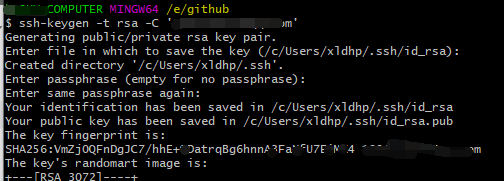

1. 安装Git后，配置用户名及邮箱

	```sh
	配置全局用户名
	git config --global user.name "xxx"
	
	配置全局邮箱
	git config --global user.email xxx
	
	查看配置信息
	git config --list
	```

	

2. 生成密钥

	```sh
	ssh-keygen -t rsa -C '登录邮箱'
	```

	

	会提示保存的位置，以及输入密钥密码，这里直接回车不输入密码。

	使用时，复制id_rsa.pub 公钥到Git 服务器


常用命令：

　　`git init`  :   把当前的目录变成可以管理的git仓库，生成隐藏.git文件。

　　`git add XX`    把xx文件添加到暂存区去。

　　`git commit –m “XX”` 提交文件 –m 后面的是注释。

　　`git status`    查看仓库状态

　　`git diff XX`   查看XX文件修改了那些内容

　　`git log`     查看历史记录

　　`git reset --hard HEAD^` 或者 `git reset --hard HEAD~` 回退到上一个版本

　　(如果想回退到100个版本，使用`git reset –hard HEAD~100` )

　　`git reflog`    查看历史记录的版本号id

　　`git checkout -- XX` 把XX文件在工作区的修改全部撤销。

　　`git rm XX`     删除XX文件

　　`git push origin master` 把当前master分支推送到远程库

　　`git checkout –b dev` 创建dev分支 并切换到dev分支上

　　`git branch` 查看当前所有的分支

　　`git checkout master` 切换回master分支

　　`git merge dev`  在当前的分支上合并dev分支

　　`git branch –d dev` 删除dev分支

　　`git branch name` 创建分支

　　`git stash` 把当前的工作隐藏起来 等以后恢复现场后继续工作

　　`git stash list` 查看所有被隐藏的文件列表

　　`git stash apply` 恢复被隐藏的文件，但是内容不删除

　　`git stash drop` 删除文件

　　`git stash pop` 恢复文件的同时 也删除文件

　　`git remote` 查看远程库的信息

　　`git remote –v` 查看远程库的详细信息

　　`git push origin master` Git会把master分支推送到远程库对应的远程分支上