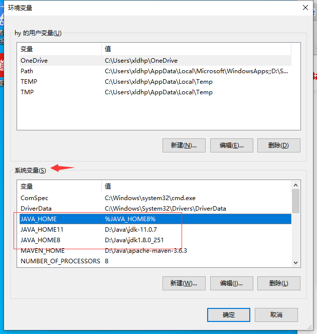
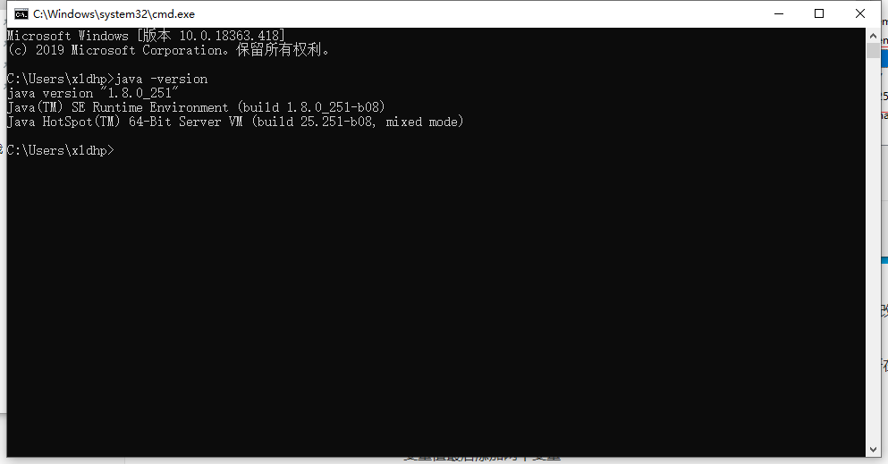

1. 安装JDK到目录

2. 配置环境变量

	1. 点开系统的环境变量配

		

	2. 在系统变量中新建变量

		

		​	新建变量，变量值为JDK所在路径

		​	这里是配置里多个JDK，方便更改使用的JDK版本。更改版本时，只需要修改`JAVA_HOME`的值：`%JAVA_HOME8%` ，改为对应的变量，如：`%JAVA_HOME11%`

		​	如果配置单个JDK，只需要新建一个`JAVA_HOME`变量即可，变量值为JDK所在路径

		

	3. 寻找 Path 变量→编辑

		变量值最后添加两个变量

		```
		%JAVA_HOME%\bin
		%JAVA_HOME%\jre\bin
		```

		

	4. 在系统变量中，新建CLASSPATH变量，变量值为：

		```
		.;%JAVA_HOME%\lib;%JAVA_HOME%\lib\tool.jar
		```

		[^]: 注意变量值最前方的 .

	5. 检验是否配置成功 运行cmd 输入 java -version

		