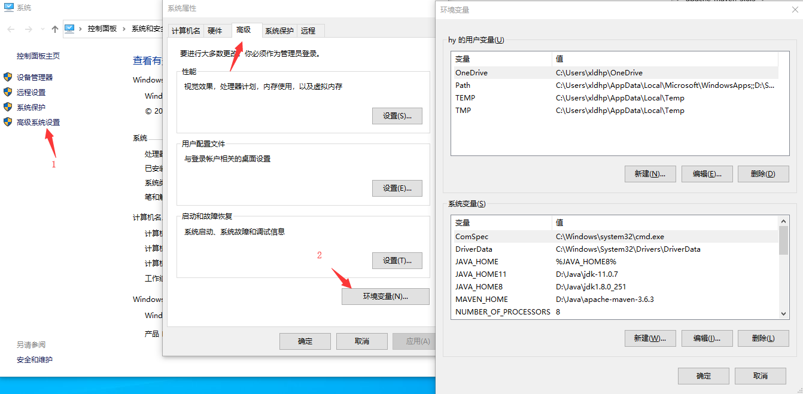
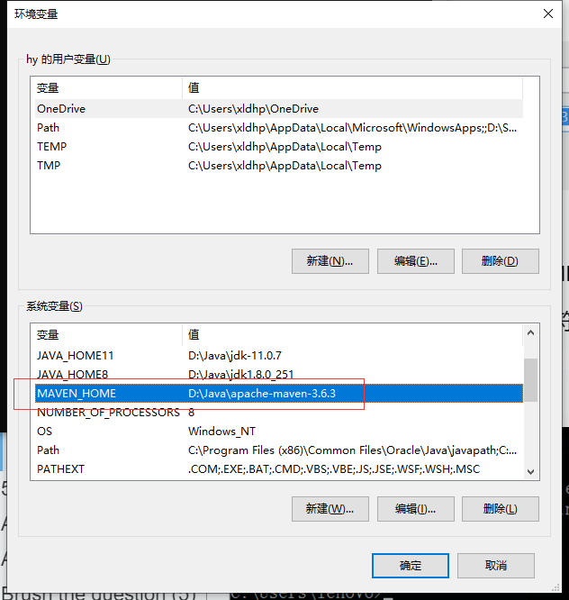
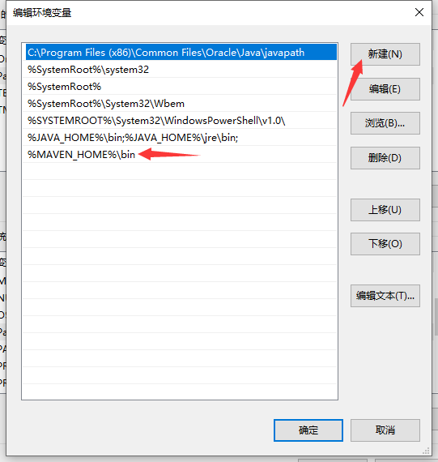
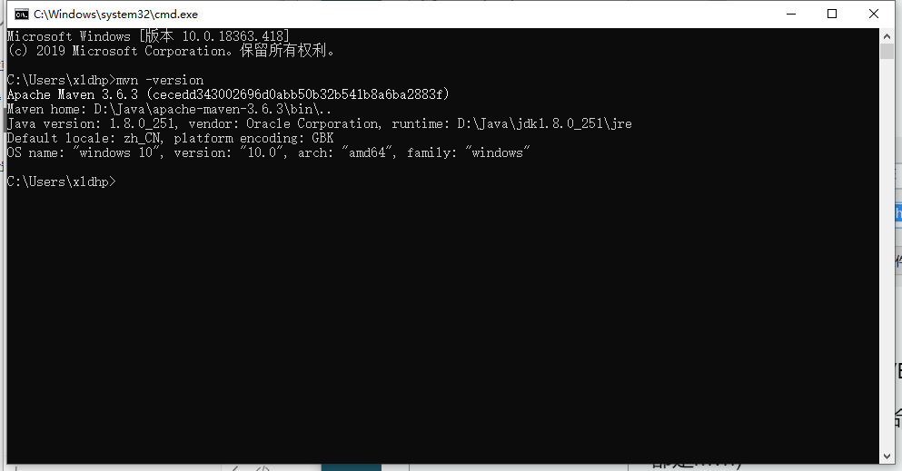
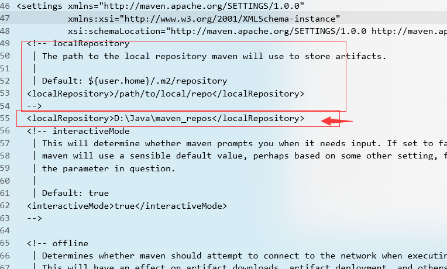

1. 下载Maven并解压

2. 进入系统环境变量

	

3. 添加Maven环境变量

	

	变量值为 maven的目录

4. 寻找 Path 变量→编辑

	

	新建值：

	```
	%MAVEN_HOME%\bin
	```

5. 验证mavne是否安装成功，在cmd 中输入：`mvn -version`

	

	

	<font color="red">注意：maven需要Jdk配置完成后</font>

	

6. 配置本地仓库

	因为maven本地仓库默认是在C盘下，所以为了节省C盘空间，可以选择将maven本地仓库移至其他盘

	1. 在其他盘新建一个maven本地仓库目录`maven_repos`

	2. 打开maven解压的文件，找到config目录下面的settings.xml文件

	3. 复制

		```xml
		<localRepository>/path/to/local/repo</localRepository>
		```

		将`localRepository`中的变量设置为 新建的 `maven_repos` 绝对路径

		

		

7. 设置maven远程仓库

	1. 打开maven解压的文件，找到config目录下面的settings.xml文件

2）在settings.xml文件中添加阿里云的地址

```xml
<mirrors>
	<mirror>
		<id>alimaven</id>
		<name>aliyun maven</name>
		<url>
			http://maven.aliyun.com/nexus/content/groups/public/
		</url>
		<mirrorOf>*</mirrorOf>
	</mirror>
</mirrors>
```

