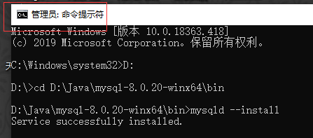

1. 官网下载安装包：https://dev.mysql.com/downloads/mysql/

	

2. 解压后，以管理员打开cmd，进入MySQL的bin文件目录下

3. 执行`mysqld --install` 安装mysql

	

	

4. 初始化mysql，完成后，会得到一组初始密码

	```sh
	mysqld --initialize --console
	```

	

	<font color="red">注意：MySQL5.7以前的版本在安装时不需要执行第e步中的mysqld –initialize命令</font>

5. 启动mysql 

	```
	net start mysql
	```

	并登陆mysql，密码是初始化时，给的初始随机密码

	```
	mysql -u root -p
	```

	

6. 初始化随机密码复杂，可以选择修改密码

	```sh
	ALTER USER 'root'@'localhost' IDENTIFIED WITH MYSQL_NATIVE_PASSWORD BY '123456';
	```

	上面命令是修改`root`账号密码为`123456`


#### 设置mysql的系统全局变量

1. 点击"我的电脑"-->"属性"-->''高级系统设置''-->''环境变量''

2. 新建mysql系统变量，并添加到PATH变量中

	

3. 点击确定，完成配置