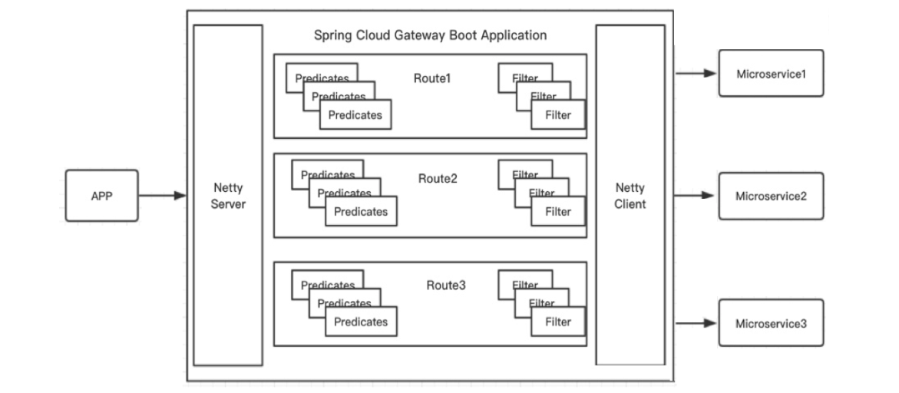
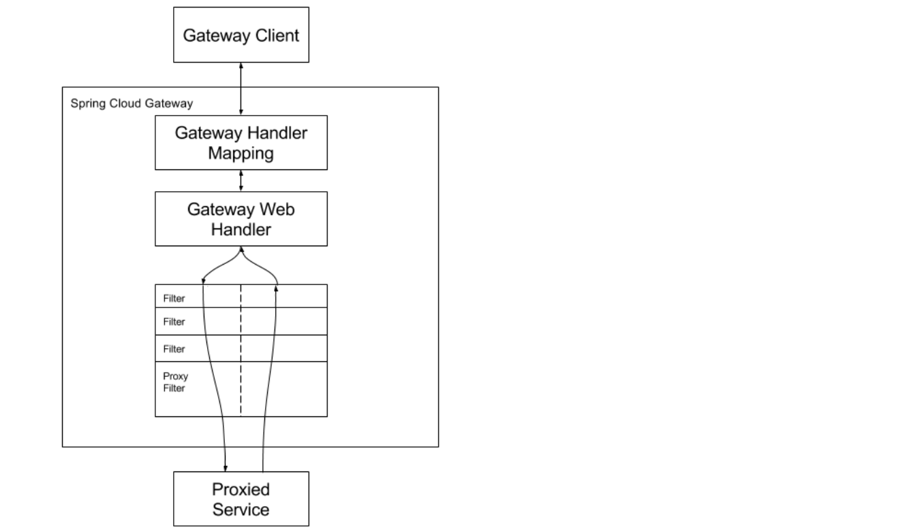
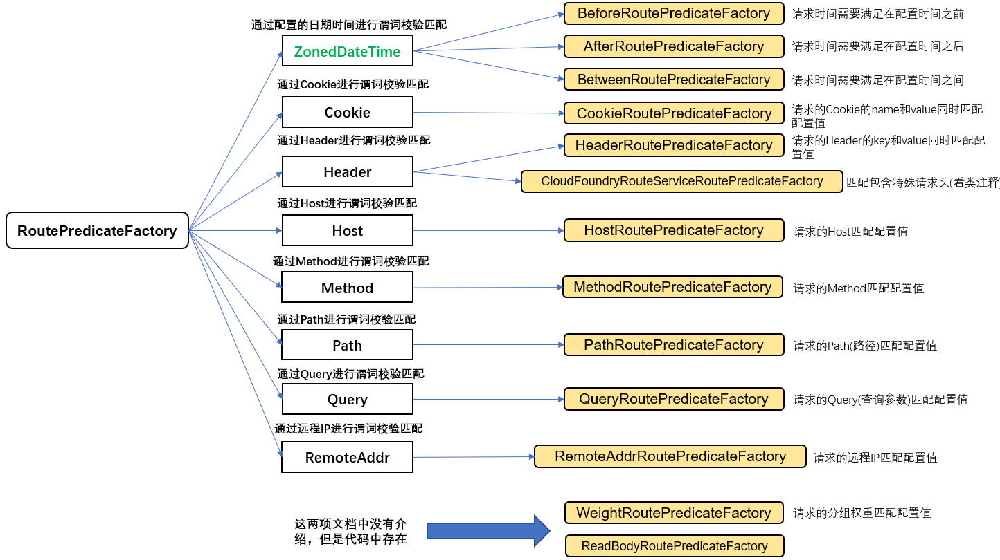

### 六.GateWay网关

#### 1.GateWay概述

Gateway是在Spring生态系统之上构建的API网关服务，依赖于[Spring Boot 2.0](https://spring.io/projects/spring-boot#learn), [Spring WebFlux](https://docs.spring.io/spring/docs/current/spring-framework-reference/web-reactive.html),和[Project Reactor](https://projectreactor.io/docs)，许多熟悉的同步类库(例如`Spring-Data`和`Spring-Security`)和同步编程模式在`Spring Cloud Gateway`中并不适用。[Spring Cloud Gateway官方文档地址](https://cloud.spring.io/spring-cloud-static/spring-cloud-gateway/2.1.0.RC3/single/spring-cloud-gateway.html)

Spring Cloud Gateway 具有如下特性：

- 基于Spring Framework 5, Project Reactor 和 Spring Boot 2.0 进行构建；
- 动态路由：能够匹配任何请求属性；
- 可以对路由指定 Predicate（断言）和 Filter（过滤器）；
- 集成Hystrix的断路器功能；
- 集成 Spring Cloud 服务发现功能；
- 请求限流功能；
- 支持路径重写。

路由(Route)：路由是网关的基本组件。它由ID，目标URI，谓词(Predicate)集合和过滤器集合定义。如果谓词聚合判断为真，则匹配路由。

谓词(Predicate)：使用的是Java8中基于函数式编程引入的[java.util.Predicate](https://docs.oracle.com/javase/8/docs/api/java/util/function/Predicate.html)。使用谓词(聚合)判断的时候，输入的参数是`ServerWebExchange`类型，它允许开发者匹配来自HTTP请求的任意参数，例如HTTP请求头、HTTP请求参数等等。

过滤器(Filter)：使用的是指定的`GatewayFilter`工厂所创建出来的`GatewayFilter`实例，可以在发送请求到下游之前或者之后修改请求(参数)或者响应(参数)。





Predicates断言就是匹配条件，而Filter是拦截器，结合URL可以实现一个具体的路由转发。





客户端向Spring Cloud GateWay发出请求，然后在GateWay Handler Mapping中找到与请求相匹配的路由，将其发送到GateWay Web Handler；Handler再通过指定的过滤器链来将请求发送到我们实际的服务执行业务逻辑，然后返回。过滤器之间用虚线分开是因为过滤器可能会在发送代理请求之前（pre）或者之后（post）执行业务逻辑。(路由转发+执行过滤器链） Filter在“pre”类型过滤器中可以做参数校验、权限校验、流量监控、日志输出、协议转换等，在“post”类型的过滤器中可以做响应内容、响应头的修改、日志的输出、流量监控等。

#### 2.GateWay应用

引入依赖：

```xml
<dependency>
    <groupId>org.springframework.cloud</groupId>
    <artifactId>spring-cloud-starter-gateway</artifactId>
</dependency>
<dependency>
    <groupId>org.springframework.cloud</groupId>
    <artifactId>spring-cloud-starter-netflix-eureka-client</artifactId>
</dependency>
```

路由配置：

> Gateway 提供了两种不同的方式用于配置路由，一种是通过yml文件来配置，另一种是通过Java Bean来配置

在application.yml中配置：

```yaml
server:
  port: 9201
spring:
  cloud:
    gateway:
      routes:
        - id: path_route #路由的ID
          uri: ${service-url.user-service}/user/{id} #匹配后路由地址
          predicates: # 断言，路径相匹配的进行路由
            - Path=/user/{id}
service-url:
  user-service: http://localhost:8201
```

使用Java Bean配置：添加相关配置类，配置一个RouteLocator对象

```java
@Configuration
public class GatewayConfig {

    @Bean
    public RouteLocator customRouteLocator(RouteLocatorBuilder builder) {
        return builder.routes()
                .route("path_route2", r -> r.path("/user/getByUsername")
                        .uri("http://localhost:8201/user/getByUsername"))
                .build();
    }
}
```

#### 3.GateWay路由规则

`Spring Cloud Gateway`自身包含了很多内建的路由谓词工厂。这些谓词分别匹配一个HTTP请求的不同属性。多个路由谓词工厂可以用`and`的逻辑组合在一起。





##### 指定日期时间路由谓词

- 匹配请求在指定日期时间之前。
- 匹配请求在指定日期时间之后。
- 匹配请求在指定日期时间之间。

配置的日期时间必须满足`ZonedDateTime`的格式：年月日和时分秒用'T'分隔,接着-07:00是和UTC相差的时间，最后的[America/Denver]是所在的时间地区 `2017-01-20T17:42:47.789-07:00[America/Denver]`

```yaml
server 
  port: 9090
spring:
  cloud:
    gateway:
      routes:
      - id: between_route
        uri: https://example.org
        predicates:
        - Between=2019-05-01T00:00:00+08:00[Asia/Shanghai],2019-05-02T00:00:00+08:00[Asia/Shanghai]
```

##### Cookie路由谓词

`CookieRoutePredicateFactory`需要提供两个参数，分别是Cookie的name和一个正则表达式(value)。只有在请求中的Cookie对应的name和value和Cookie路由谓词中配置的值匹配的时候，才能匹配命中进行路由。

```yaml
server 
  port: 9090
spring:
  cloud:
    gateway:
      routes:
       - id: cookie_route
        uri: https://example.org
        predicates:
         - Cookie=doge,aaa
```

请求需要携带一个Cookie，name为doge，value需要匹配正则表达式"aaa"才能路由到`https://example.org`。

##### Header路由谓词

`HeaderRoutePredicateFactory`需要提供两个参数，分别是Header的name和一个正则表达式(value)。只有在请求中的Header对应的name和value和Header路由谓词中配置的值匹配的时候，才能匹配命中进行路由。

##### Host路由谓词

`HostRoutePredicateFactory`只需要指定一个主机名列表，列表中的每个元素支持Ant命名样式，使用`.`作为分隔符，多个元素之间使用`,`区分。Host路由谓词实际上针对的是HTTP请求头中的`Host`属性。

```yaml
spring:
  cloud:
    gateway:
      routes:
        - id: host_route
          uri: http://localhost:9091
          predicates:
            - Host=localhost:9090
```

##### 请求方法路由谓词

`MethodRoutePredicateFactory`只需要一个参数：要匹配的HTTP请求方法。

```yaml
spring:
  cloud:
    gateway:
      routes:
        - id: method_route
          uri: http://localhost:9091
          predicates:
            - Method=GET
```

##### 请求路径路由谓词

`PathRoutePredicateFactory`需要`PathMatcher`模式路径列表和一个可选的标志位参数`matchOptionalTrailingSeparator`。这个是最常用的一个路由谓词。

```yaml
spring:
  cloud:
    gateway:
      routes:
        - id: path_route
          uri: http://localhost:9091
          predicates:
            - Path=/order/path
```

##### 请求查询参数路由谓词

`QueryRoutePredicateFactory`需要一个必须的请求查询参数(param的name)以及一个可选的正则表达式(regexp)。

```yaml
spring:
  cloud:
    gateway:
      routes:
      - id: query_route
        uri: http://localhost:9091
        predicates:
        - Query=doge,aaa.
```

##### 远程IP地址路由谓词

`RemoteAddrRoutePredicateFactory`匹配规则采用CIDR符号（IPv4或IPv6）字符串的列表（最小值为1），例如192.168.0.1/16（其中192.168.0.1是远程IP地址并且16是子网掩码）。

```yaml
spring:
  cloud:
    gateway:
      routes:
      - id: remoteaddr_route
        uri: https://example.org
        predicates:
        - RemoteAddr=192.168.1.1/24
```

##### 多个路由谓词组合

因为路由配置中的`predicates`属性其实是一个列表，可以直接添加多个路由规则：

```yaml
spring:
  cloud:
    gateway:
      routes:
      - id: remoteaddr_route
        uri: http://localhost:9091
        predicates:
        - RemoteAddr=xxxx
        - Path=/yyyy
        - Query=zzzz,aaaa
```

##### GateWay动态路由

GateWay⽀持自动从注册中心获取服务列表并访问，即所谓的动态路由。

>  动态路由设置时，uri以 lb: //开头（lb代表从注册中心获取服务），后面是需要转发到的服务名称

#### 4.GateWay过滤器

##### GatewayFilter工厂

路由过滤器`GatewayFilter`允许修改进来的HTTP请求内容或者返回的HTTP响应内容。**路由过滤器的作用域是一个具体的路由配置**。`Spring Cloud Gateway`提供了丰富的内建的`GatewayFilter`工厂，可以按需选用。

目前`GatewayFilter`工厂的内建实现如下：

| ID                        | 类名                                          | 类型 | 功能                                                         |
| ------------------------- | --------------------------------------------- | ---- | ------------------------------------------------------------ |
| StripPrefix               | StripPrefixGatewayFilterFactory               | pre  | 移除请求URL路径的第一部分，例如原始请求路径是/order/query，处理后是/query |
| SetStatus                 | SetStatusGatewayFilterFactory                 | post | 设置请求响应的状态码，会从org.springframework.http.HttpStatus中解析 |
| SetResponseHeader         | SetResponseHeaderGatewayFilterFactory         | post | 设置(添加)请求响应的响应头                                   |
| SetRequestHeader          | SetRequestHeaderGatewayFilterFactory          | pre  | 设置(添加)请求头                                             |
| SetPath                   | SetPathGatewayFilterFactory                   | pre  | 设置(覆盖)请求路径                                           |
| SecureHeader              | SecureHeadersGatewayFilterFactory             | pre  | 设置安全相关的请求头，见SecureHeadersProperties              |
| SaveSession               | SaveSessionGatewayFilterFactory               | pre  | 保存WebSession                                               |
| RewriteResponseHeader     | RewriteResponseHeaderGatewayFilterFactory     | post | 重新响应头                                                   |
| RewritePath               | RewritePathGatewayFilterFactory               | pre  | 重写请求路径                                                 |
| Retry                     | RetryGatewayFilterFactory                     | pre  | 基于条件对请求进行重试                                       |
| RequestSize               | RequestSizeGatewayFilterFactory               | pre  | 限制请求的大小，单位是byte，超过设定值返回`413 Payload Too Large` |
| RequestRateLimiter        | RequestRateLimiterGatewayFilterFactory        | pre  | 限流                                                         |
| RequestHeaderToRequestUri | RequestHeaderToRequestUriGatewayFilterFactory | pre  | 通过请求头的值改变请求URL                                    |
| RemoveResponseHeader      | RemoveResponseHeaderGatewayFilterFactory      | post | 移除配置的响应头                                             |
| RemoveRequestHeader       | RemoveRequestHeaderGatewayFilterFactory       | pre  | 移除配置的请求头                                             |
| RedirectTo                | RedirectToGatewayFilterFactory                | pre  | 重定向，需要指定HTTP状态码和重定向URL                        |
| PreserveHostHeader        | PreserveHostHeaderGatewayFilterFactory        | pre  | 设置请求携带的属性preserveHostHeader为true                   |
| PrefixPath                | PrefixPathGatewayFilterFactory                | pre  | 请求路径添加前置路径                                         |
| Hystrix                   | HystrixGatewayFilterFactory                   | pre  | 整合Hystrix                                                  |
| FallbackHeaders           | FallbackHeadersGatewayFilterFactory           | pre  | Hystrix执行如果命中降级逻辑允许通过请求头携带异常明细信息    |
| AddResponseHeader         | AddResponseHeaderGatewayFilterFactory         | post | 添加响应头                                                   |
| AddRequestParameter       | AddRequestParameterGatewayFilterFactory       | pre  | 添加请求参数，仅仅限于URL的Query参数                         |
| AddRequestHeader          | AddRequestHeaderGatewayFilterFactory          | pre  | 添加请求头                                                   |

`GatewayFilter`工厂使用的时候需要知道其ID以及配置方式，配置方式可以看对应工厂类的公有静态内部类`XXXXConfig`。

##### GlobalFilter工厂

`GlobalFilter`的功能其实和`GatewayFilter`是相同的，只是`GlobalFilter`的作用域是所有的路由配置，而不是绑定在指定的路由配置上。多个`GlobalFilter`可以通过`@Order`或者`getOrder()`方法指定每个`GlobalFilter`的执行顺序，order值越小，`GlobalFilter`执行的优先级越高。

目前`Spring Cloud Gateway`提供的内建的`GlobalFilter`如下：

| 类名                     | 功能                    |
| ------------------------ | ----------------------- |
| ForwardRoutingFilter     | 重定向                  |
| LoadBalancerClientFilter | 负载均衡                |
| NettyRoutingFilter       | Netty的HTTP客户端的路由 |
| NettyWriteResponseFilter | Netty响应进行写操作     |
| RouteToRequestUrlFilter  | 基于路由配置更新URL     |
| WebsocketRoutingFilter   | Websocket请求转发到下游 |

内建的`GlobalFilter`大多数和`ServerWebExchangeUtils`的属性相关。

#### 5.跨域配置和Actuator端点

**跨域配置**：

网关可以通过配置来控制全局的CORS行为。全局的CORS配置对应的类是`CorsConfiguration`，这个配置是一个URL模式的映射。例如`application.yaml`文件如下：

```yaml
spring:
  cloud:
    gateway:
      globalcors:
        corsConfigurations:
          '[/**]':
            allowedOrigins: "https://docs.spring.io"
            allowedMethods:
            - GET
```

对于所有请求的路径，将允许来自`docs.spring.io`并且是GET方法的CORS请求。

**Actuator端点相关**：

引入`spring-boot-starter-actuator`，需要做以下配置开启`gateway`监控端点：

```properties
management.endpoint.gateway.enabled=true 
management.endpoints.web.exposure.include=gateway
```

目前支持的端点列表：

| ID            | 请求路径                        | HTTP方法 | 描述                                      |
| ------------- | ------------------------------- | -------- | ----------------------------------------- |
| globalfilters | /actuator/gateway/globalfilters | GET      | 展示路由配置中的GlobalFilter列表          |
| routefilters  | /actuator/gateway/routefilters  | GET      | 展示绑定到对应路由配置的GatewayFilter列表 |
| refresh       | /actuator/gateway/refresh       | POST     | 清空路由配置缓存                          |
| routes        | /actuator/gateway/routes        | GET      | 展示已经定义的路由配置列表                |
| routes/{id}   | /actuator/gateway/routes/{id}   | GET      | 展示对应ID已经定义的路由配置              |
| routes/{id}   | /actuator/gateway/routes/{id}   | POST     | 添加一个新的路由配置                      |
| routes/{id}   | /actuator/gateway/routes/{id}   | DELETE   | 删除指定ID的路由配置                      |

其中`/actuator/gateway/routes/{id}`添加一个新的路由配置请求参数的格式如下：

```json
{
  "id": "first_route",
  "predicates": [{
    "name": "Path",
    "args": {"doge":"/example"}
  }],
  "filters": [],
  "uri": "https://example.org",
  "order": 0
}
```

#### 参考

- [Spring Cloud Gateway：新一代API网关服务](https://juejin.im/post/6844903982599684103)
- [Spring Cloud Gateway入坑记](https://juejin.im/post/6844903834687373319)
- [Spring Cloud Gateway 入门](https://juejin.im/post/6844903573831024653)

### 参考链接

- [Spring Cloud官网](https://spring.io/projects/spring-cloud)
- [Spring Cloud中文社区](https://www.springcloud.cc/)
- [Spring Cloud中国社区](http://docs.springcloud.cn/user-guide/eureka/)
- [冒着挂科的风险也要给你们看的Spring Cloud入门总结](https://juejin.im/post/6844904007975043079)
- [Spring Cloud学习](https://blog.csdn.net/u012702547/article/details/78547925)
- [Spring Cloud Config：外部集中化配置管理](https://juejin.im/post/6844903966405296142)
- [Spring Cloud Bus：消息总线](https://juejin.im/post/6844903968158547976)


作者：smileRadiantly
链接：https://juejin.im/post/6857291841767735310
来源：掘金
著作权归作者所有。商业转载请联系作者获得授权，非商业转载请注明出处。