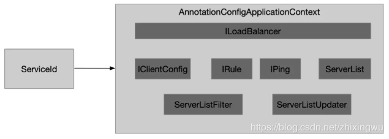

### Ribbon负载均衡

#### 1.负载均衡概述

负载均衡一般分为服务器端负载均衡和客服端负载均衡：

- **服务端负载均衡**，比如Nginx、F5这些，请求到达服务器之后由这些负载均衡器根据一定的算法将请求路由到目标服务器处理
- **客服端负载均衡**，比如Ribbon，服务消费者客户端会有一个服务器地址列表，调用方在请求前通过一定的负载均衡算法选择一个服务器进行访问，负载均衡算法的执行是在请求客户端进行

Ribbon是Netflix发布的负载均衡器。Eureka一般配合Ribbon进行使用，Ribbon利用从Eureka中读取到服务信息，在调用服务提供者提供的服务时，会根据一定的算法进行负载。

#### 2.Ribbon核心组件IRule

所谓的负载均衡策略，就是当A服务调用B服务时，此时B服务有多个实例，这时A服务以何种方式来选择调用的B实例，ribbon可以选择以下几种负载均衡策略。

IRule:根据特定算法中从服务列表中选取一个要访问的服务：

- RoundRobinRule: 轮询策略。
- RandomRule: 随机策略。
- AvailabilityFilteringRule: 可用过滤策略。会先过滤掉由于多次访问故障而处于断路跳闸状态的服务，还有并发的连接数量超过阀值的服务，然后对剩余的服务列表按照轮询策略进行访问
- WeightedResponseTimeRule: 权重轮询策略。根据平均响应时间计算所有服务的权重，响应时间越快服务权重越大，被选中的概率越高，刚启动时，如果统计信息不足，则使用RoundRobinRule策略，等统计信息足够，会切换到WeightedResponseTimeRule
- RetryRule: 重试策略。在RoundRobinRule的基础上添加重试机制，即在指定的重试时间内，反复使用线性轮询策略来选择可用实例
- BestAvailableRule: 最小连接数策略。先过滤掉由于多次访问故障而处于断路器跳闸状态的服务，然后选择一个并发量最小的服务
- ZoneAvoidanceRule: 区域权衡策略（默认规则）。采用双重过滤，同时过滤不是同一区域的实例和故障实例，选择并发较小的实例

**Ribbon已有策略应用**：

全局设置：

```java
@Configuration
public class ConfigBean {

    @Bean
    @LoadBalanced
    public RestTemplate getRestTemplate(){
        return new RestTemplate();
    }

    //用新定义的负载均衡规则覆盖默认的负载均衡规则
    @Bean
    public IRule myRule(){
        //return new RoundRobinRule();// todo 轮询
        //return new RandomRule();//todo 随机
        return new RetryRule();//todo 先按照轮询的策略获取服务，如果获取服务失败则在指定时间内会进行重试，获取可用的服务
    }
}
```

局部设置：修改配置文件指定服务的负载均衡策略。格式：`服务应用名.ribbon.NFLoadBalancerRuleClassName`

```yaml
#针对的被调用方微服务名称,不加就是全局生效
# service-provider 为调用的服务的名称
service-provider:
  ribbon:
    NFLoadBalancerRuleClassName: com.netflix.loadbalancer.RandomRule # 负载策略调整
```

**自定义Ribbon的负载均衡策略**：

- 启动类添加@RibbonClient：在启动该微服务的时候就能去加载我们的自定义Ribbon配置类，从而使配置生效
- 注意配置细节：官方文档明确给出了警告，自定义配置类不能放在@ComponentScan所描述的当前包下以及其子包下否则这个配置类就会被所有的Ribbon客户端所共享，达不到特殊化定制的目的

需求:依旧轮询策略，但是加上新需求，每台服务器要求被调用5次

- 主启动类添加注解：`@RibbonClient(name = "MICROSERVICECLOUD-DEPT",configuration = MySelfRule.class)`

- 注入自定义负载均衡算法：

	```java
	@Configuration
	public class MySelfRule {
	    @Bean
	    public IRule myRule(){
	        return new RandomRule_ZY();//todo 自定义负载均衡算法
	    }
	}
	```

- 自定义算法：

	```java
	public class RandomRule_ZY extends AbstractLoadBalancerRule {
	    
	    public Server choose(ILoadBalancer lb, Object key) { // ...... }
	        
	    @Override
	    public void initWithNiwsConfig(IClientConfig iClientConfig) {}
	
	    @Override
	    public Server choose(Object key) {
	        return this.choose(this.getLoadBalancer(), key);
	    }   
	    
	}
	```

#### 3.Ribbon常用配置

全局配置：

```yaml
ribbon:
  ConnectTimeout: 1000 #服务请求连接超时时间（毫秒）
  ReadTimeout: 3000 #服务请求处理超时时间（毫秒）
  OkToRetryOnAllOperations: true #对超时请求启用重试机制
  MaxAutoRetriesNextServer: 1 #切换重试实例的最大个数
  MaxAutoRetries: 1 # 切换实例后重试最大次数
  NFLoadBalancerRuleClassName: com.netflix.loadbalancer.RandomRule #修改负载均衡算法
```

指定服务进行配置：与全局配置的区别就是ribbon节点挂在服务名称下面，如下是对ribbon-service调用user-service时的单独配置

```yaml
user-service:
  ribbon:
    ConnectTimeout: 1000 #服务请求连接超时时间（毫秒）
    ReadTimeout: 3000 #服务请求处理超时时间（毫秒）
    OkToRetryOnAllOperations: true #对超时请求启用重试机制
    MaxAutoRetriesNextServer: 1 #切换重试实例的最大个数
    MaxAutoRetries: 1 # 切换实例后重试最大次数
    NFLoadBalancerRuleClassName: com.netflix.loadbalancer.RandomRule #修改负载均衡算法
```

#### 4.Ribbon应用和原理

不需要引用额外的Jar坐标，因为**在服务消费者中我们引用过eureka-client，它会引用Ribbon相关Jar包**。

使用@LoadBalanced注解赋予RestTemplate负载均衡的能力：可以看出使用Ribbon的负载均衡功能非常简单，和直接使用RestTemplate没什么两样，只需给RestTemplate添加一个@LoadBalanced即可。

```java
@Configuration
public class RibbonConfig {

    @Bean
    @LoadBalanced   // Ribbon负载均衡
    public RestTemplate restTemplate(){
        return new RestTemplate();
    }
}
```

原理：

LoadBalancerClient 接口中定义了 ServiceInstance choose(String serviceId) 方法，根据服务名获取具体的服务实例；

SpringClientFactory 类中定义了 Map<String, AnnotationConfigApplicationContext> contexts，其中 key 为 serviceId，value 为 AnnotationConfigApplicationContext 对象。**这意味着可以为每个服务设置不同的负载均衡策略**。AnnotationConfigApplicationContext 中主要保存了 ILoadBalancer bean，定义了负载均衡的实现；而后者又依赖于：

- IClientConfig：定义了客户端配置，用于初始化客户端以及负载均衡配置；默认值DefaultClientConfigImpl
- IRule：负载均衡的策略，比如轮询等；默认值ZoneAvoidanceRule
- IPing：定义了如何确定服务实例是否正常；默认值DumyPing
- ServerList：定义了获取服务器列表的方法；默认值 **Ribbon:**`ConfigurationBasedServerList` **Spring Cloud Alibaba:**`NacosServerList`
- ServerListFilter：根据配置或者过滤规则选择特定的服务器列表；默认值ZonePreferenceServerListFilter
- ServerListUpdater：定义了动态更新服务器列表的策略。默认值PollingServerListUpdater

以上默认实现参考 `RibbonClientConfiguration. ZoneAwareLoadBalancer`，关系图如下：





AnnotationConfigApplicationContext 中确定 ILoadBalancer 的次序是：优先通过外部配置导入，其次是配置类。

Ribbon默认是懒加载的。当服务起动好之后，第一次请求是非常慢的，第二次之后就快很多。开启饥饿加载：

```yaml
ribbon:
  eager-load:
    enabled: true  #开启饥饿加载
    clients: server-1,server-2,server-3  #为哪些服务的名称开启饥饿加载,多个用逗号分隔
```

#### 参考

- [Spring Cloud Ribbon 源码解析](https://juejin.im/post/6844904079139799053)
- [Spring Cloud Ribbon：负载均衡的服务调用](https://juejin.im/post/6844903943084965902)
- [Ribbon源码解析](https://juejin.im/post/6844903775128256519)