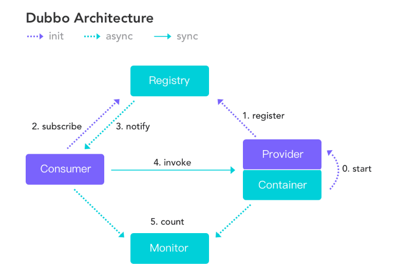
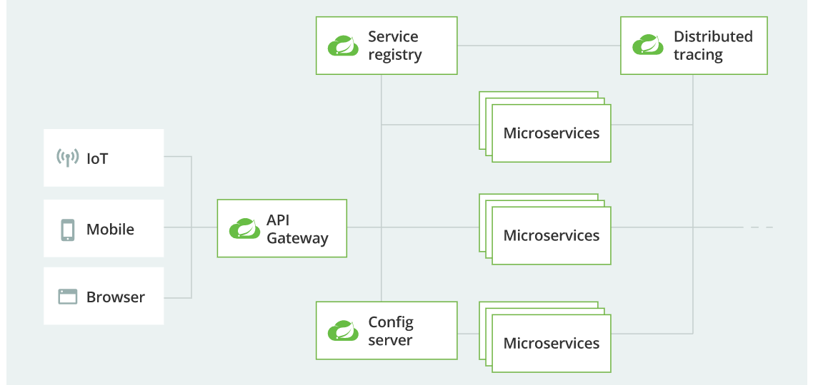

# 1.什么是微服务？微服务之间如何独立通讯？

## 什么是微服务？

​	微服务概念起源:  [Microservices](https://martinfowler.com/articles/microservices.html)

微服务是用一组小服务的方式来构建一个应用，服务独立运行在不同的进程中，服务之间通过轻量的通讯机制（如RESTful接口）来交互，并且服务可以通过自动化部署方式独立部署。正因为微服务架构中，服务之间是相互独立的，所以不同的服务可以使用不同的语言来开发，或者根据业务的需求使用不同类型的数据库。

- 微服务架构是一个分布式系统, 按照业务进行划分成为不同的服务单元, 解决单体系统性能等不足。
- 微服务是一种架构风格，一个大型软件应用由多个服务单元组成。系统中的服务单元可以单独部署，各个服务单元之间是松耦合的。

## 微服务之间如何独立通讯？

**同步**：

**REST HTTP协议**：REST 请求在微服务中是最为常用的一种通讯方式, 它依赖于 HTTP\HTTPS 协议。RESTFUL 的特点是：

- 每一个 URI 代表 1 种资源 
- 客户端使用 GET、POST、PUT、DELETE 4 个表示操作方式的动词对服务端资源进行操作: GET 用来获取资源, POST 用来新建资源(也可以用于更新资源), PUT 用来更新资源, DELETE 用来删除资源 
- 通过操作资源的表现形式来操作资源，资源的表现形式是 XML 或者 HTML 
- 客户端与服务端之间的交互在请求之间是无状态的,从客户端到服务端的每个请求都必须包含理解请求所必需的信息

**RPC TCP协议**：RPC(Remote Procedure Call)远程过程调用，简单的理解是一个节点请求另一个节点提供的服务。它的工作流程是这样的：

1.执行客户端调用语句，传送参数 2. 调用本地系统发送网络消息 3. 消息传送到远程主机 4. 服务器得到消息并取得参数 5. 根据调用请求以及参数执行远程过程（服务） 6. 执行过程完毕，将结果返回服务器句柄 7. 服务器句柄返回结果，调用远程主机的系统网络服务发送结果 8. 消息传回本地主机 9. 客户端句柄由本地主机的网络服务接收消息 10. 客户端接收到调用语句返回的结果数据

**异步**：消息中间件

常见的消息中间件有 Kafka、RabbitMQ、RocketMQ、ActiveMQ , 常见的协议有AMQP、MQTTP、STOMP、XMPP。

# 2.微服务技术栈有哪些？

- 微服务开发：快速开发服务。[Spring](https://spring.io/)、SpringMVC、[SpringBoot](https://spring.io/projects/spring-boot)

- 微服务调用协议：REST、RPC（Remote Procedure Call）、RMI（Remote Method Invocation）

- 微服务**注册发现**：发现服务，注册服务，集中管理服务。[Eureka](https://github.com/Netflix/eureka)、[Zookeeper](https://github.com/apache/zookeeper)、[Nacos](https://nacos.io/zh-cn/)、[consul](https://github.com/hashicorp/consul)

- 微服务**配置管理**：统一管理一个或多个服务的配置信息, 集中管理。[Disconf](https://github.com/knightliao/disconf)、[SpringCloudConfig](https://github.com/spring-cloud/spring-cloud-config)、[Apollo](https://github.com/ctripcorp/apollo)

- 服务**负载均衡**：[Ribbon](https://github.com/Netflix/ribbon)（客户端）、[Nginx](https://github.com/nginx/nginx)（服务端）

- **服务熔断**：当请求到达一定阈值时不让请求继续。[Hystrix](https://github.com/Netflix/Hystrix)、[Sentinel](https://github.com/alibaba/Sentinel)

- 服务**接口调用**：多个服务之间的通讯。[Feign(HTTP)](https://github.com/OpenFeign/feign)（HTTP）、[Dubbo](http://dubbo.apache.org/zh-cn/)、[Apache HttpClient](https://hc.apache.org/httpcomponents-client-ga/)、Spring RestTemplate

- **API网关**：外部请求通过 API 网关进行拦截处理, 再转发到真正的服务。[Spring Cloud GateWay](https://spring.io/projects/spring-cloud-gateway)、[Zuul](https://github.com/Netflix/zuul)

- 服务**链路追踪**：明确服务之间的调用关系。[Zipkin](https://github.com/openzipkin/zipkin)、[Brave](https://github.com/openzipkin/brave)

- **服务监控**：以可视化或非可视化的形式展示出各个服务的运行情况 (CPU、内存、访问量等)。[Zabbix](https://github.com/jjmartres/Zabbix)、[Nagios](https://www.nagios.org/)、[Metrics](https://metrics.dropwizard.io/)

- 权限认证：根据系统设置的安全规则或者安全策略, 用户可以访问而且只能访问自己被授权的资源。[Spring Security](https://spring.io/projects/spring-security)、[Apache Shiro](http://shiro.apache.org/)

- 批处理：批量处理同类型数据或事物。[Spring Batch](https://spring.io/projects/spring-batch)

- 定时任务：定时调度任务。[Quartz](http://www.quartz-scheduler.org/)、[Elastic-job](https://gitee.com/elasticjob/elastic-job)

- 消息队列：解耦业务, 异步化处理数据。[Kafka](http://kafka.apache.org/)、[RabbitMQ](https://www.rabbitmq.com/)、[RocketMQ](http://rocketmq.apache.org/)、[ActiveMQ](http://activemq.apache.org/)

- 日志采集（elk）：收集各服务日志提供日志分析、用户画像等。[Elasticsearch](https://github.com/elastic/elasticsearch)、[Logstash](https://github.com/elastic/logstash)、[Kibana](https://github.com/elastic/kibana)

- 数据存储：存储数据。关系型：[MySql](https://www.mysql.com/)、[Oracle](https://www.oracle.com/index.html)、[MsSQL](https://docs.microsoft.com/zh-cn/sql/?view=sql-server-ver15)、[PostgreSql](https://www.postgresql.org/)；非关系型：[Mongodb](https://www.mongodb.com/)、[Elasticsearch](https://github.com/elastic/elasticsearch)

- 缓存：存储数据。[redis](https://redis.io/)

- 分库分表：数据库分库分表方案。[ShardingSphere](http://shardingsphere.apache.org/)、[Mycat](http://www.mycat.io/)

- 服务部署：将项目快速部署、上线、持续集成。[Docker](http://www.docker.com/)、[Jenkins](https://jenkins.io/zh/)、[Kubernetes(K8s)](https://kubernetes.io/)、[Mesos](http://mesos.apache.org/)

	

# 3.微服务的优缺点？

微服务优点：

- 服务简单，只关注一个业务功能
- 每个微服务可由不同团队开发
- 微服务是松散耦合的
- 可用不同的编程语言与工具开发

微服务缺点：

- 运维开销，DevOps要求
- 分布式链路追踪难
- 分布式系统的复杂性，当服务数量增加，管理越加复杂

# 4.Spring Cloud 和 Dubbo有哪些区别？

Dubbo是阿⾥巴巴公司开源的⼀个⾼性能优秀的服务框架，基于RPC调⽤，对于⽬前使⽤率较⾼的 Spring Cloud Netflix来说，它是基于HTTP的，所以效率上没有Dubbo⾼，但问题在于Dubbo体系的组件不全，不能够提供⼀站式解决⽅案，⽐如服务注册与发现需要借助于Zookeeper等实现，⽽Spring Cloud Netflix则是真正的提供了⼀站式服务化解决⽅案，且有Spring⼤家族背景。

[Dubbo](http://dubbo.apache.org/zh-cn/)

- 优点：

1.支持各种通信协议，而且消费方和服务方使用长链接方式交互，通信速度上略胜 ；

2.采用rpc方式，性能上比Spring Cloud的rpc更好；

3.dubbo的网络消耗小于springcloud

- 缺点：

1.如果我们使用配置中心、分布式跟踪这些内容都需要自己去集成;

2.开发难度较大，原因是dubbo的jar包依赖问题很多大型工程无法解决；

[Spring Cloud](https://spring.io/cloud)

- 优点：

1、产出于Spring大家族，Spring在企业级开发框架中来头很大，可以保证后续的更新、完善。

2、spring cloud社区活跃，教程丰富，遇到问题很容易找到解决方案；

3、spring cloud功能比dubbo更加完善；

5、spring cloud采用rest访问方式，rest的技术无关性使用效果更棒；

6、spring cloud轻轻松松几行代码就完成了熔断、均衡负责、服务中心的各种平台功能；

7、从公司招聘工程师方面，spring cloud更有优势，因为其技术更新更炫；

8、提供了微服务的一整套解决方案：服务发现注册、配置中心、消息总线、负载均衡、断路器、数据监控等；作为一个微服务治理的大家伙，考虑的很全面，几乎服务治理的方方面面都考虑到了，方便开发开箱即用；

- 缺点：

1.如果对于系统的响应时间有严格要求，长链接更合适。

2.接口协议约定比较自由且松散，需要有强有力的行政措施来限制接口无序升级

# 5.Spring Cloud 与 Spring Boot 的关系？

Spring Boot 是 Spring 的一套快速配置脚手架，可以基于Spring Boot 快速开发单个微服务，Spring Cloud是一个基于Spring Boot实现的云应用开发工具；Spring Boot专注于快速、方便集成的单个微服务个体，Spring Cloud关注全局的服务治理框架；Spring Boot使用了默认大于配置的理念，很多集成方案已经帮你选择好了，能不配置就不配置，Spring Cloud很大的一部分是基于Spring Boot来实现，可以不基于Spring Boot吗？不可以。

总结：SpringBoot在Spring Clound中起到了承上启下的作用。Spring Boot可以离开Spring Cloud独立使用开发项目，但是Spring Cloud离不开Spring Boot，属于依赖的关系。