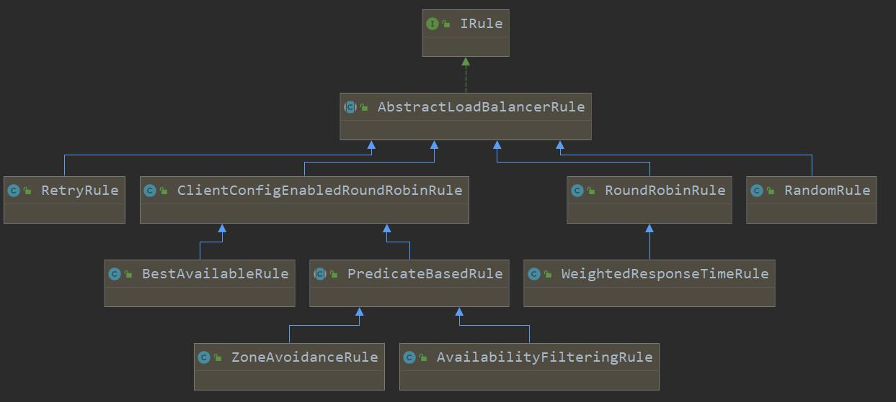

# Ribbon的负载均衡策略

## 关系依赖




## RoundRobinRule

com.netflix.loadbalancer.RoundRobinRule：轮训策略

​	对所有服务以顺序循环的方式，进行选择Server

​	源码讲解：

```java
public Server choose(ILoadBalancer lb, Object key) {
        if (lb == null) {
            log.warn("no load balancer");
            return null;
        }

        Server server = null;
        int count = 0;
        while (server == null && count++ < 10) {
            //获取可用服务
            List<Server> reachableServers = lb.getReachableServers();
            //获取所有服务
            List<Server> allServers = lb.getAllServers();
            //可用服务数量
            int upCount = reachableServers.size();
            //所有服务数量
            int serverCount = allServers.size();

            if ((upCount == 0) || (serverCount == 0)) {
                log.warn("No up servers available from load balancer: " + lb);
                return null;
            }
			//下一个服务的索引，重点轮询算法就是incrementAndGetModulo()方法
            int nextServerIndex = incrementAndGetModulo(serverCount);
            server = allServers.get(nextServerIndex);

            if (server == null) {
                /* Transient. */
                Thread.yield();
                continue;
            }

            if (server.isAlive() && (server.isReadyToServe())) {
                return (server);
            }

            // Next.
            server = null;
        }

        if (count >= 10) {
            log.warn("No available alive servers after 10 tries from load balancer: "
                    + lb);
        }
        return server;
    }
```

`incrementAndGetModulo` 方法：

```java
private int incrementAndGetModulo(int modulo) {
    for (;;) {
        int current = nextServerCyclicCounter.get();
        int next = (current + 1) % modulo;
        //CAS和自旋锁的方式返回真实值，如果真实值和期望值不同，则反复取值，直到真实值与期望值一致
        if (nextServerCyclicCounter.compareAndSet(current, next))
            return next;
    }
}
```


## RandomRule

com.netflix.loadbalancer.RandomRule：随机策略

​	在所有服务实例之间，随机选择一个服务实例


## RetryRule

com.netflix.loadbalancer.RetryRule：重试策略

先按照RoundRobinRule的策略获取服务，如果获取服务失败，则在指定时间内会进行重试


## WeightedResponseTimeRule

WeightedResponseTimeRule： 响应时间加权策略

对RoundRobinRule的扩展，响应速度越快的实例选择权重越大，越容易被选择

1. 该策略是对RoundRobinRule的扩展，增加了根据实例的运行情况来计算权重

2. 根据权重来挑选实例，以达到更优的分配效果

	

	源码解析：

	​	1、设置了一个每30秒执行权重计算的定时器

	```java
		public static final int DEFAULT_TIMER_INTERVAL = 30 * 1000;
	    
	    private int serverWeightTaskTimerInterval = DEFAULT_TIMER_INTERVAL;
	
		void initialize(ILoadBalancer lb) {        
	        if (serverWeightTimer != null) {
	            serverWeightTimer.cancel();
	        }
	        serverWeightTimer = new Timer("NFLoadBalancer-serverWeightTimer-"
	                + name, true);
	        //添加一个动态服务权重任务，每30秒执行一次服务权重计算
	        serverWeightTimer.schedule(new DynamicServerWeightTask(), 0,
	                serverWeightTaskTimerInterval);
	        // do a initial run
	        ServerWeight sw = new ServerWeight();
	        sw.maintainWeights();
	
	        Runtime.getRuntime().addShutdownHook(new Thread(new Runnable() {
	            public void run() {
	                logger
	                        .info("Stopping NFLoadBalancer-serverWeightTimer-"
	                                + name);
	                serverWeightTimer.cancel();
	            }
	        }));
	    }
	```

	​	2、定时动态服务权重任务解析：（所有服务指负载均衡的服务）

	​		（1）、获取所有服务的总响应时间

	​		（2）、通过全部服务响应时间减去每个服务的响应平均时间，并存放服务权重

	​					`finalWeights`：存放每个服务的权重，`weightSoFar`：记录所有服务最终权重

	​					响应时间越快，服务的权重越高

	```java
		class ServerWeight {
	
	        public void maintainWeights() {
	            ILoadBalancer lb = getLoadBalancer();
	            if (lb == null) {
	                return;
	            }
	            
	            if (!serverWeightAssignmentInProgress.compareAndSet(false,  true))  {
	                return; 
	            }
	            
	            try {
	                logger.info("Weight adjusting job started");
	                AbstractLoadBalancer nlb = (AbstractLoadBalancer) lb;
	                LoadBalancerStats stats = nlb.getLoadBalancerStats();
	                if (stats == null) {
	                    // no statistics, nothing to do
	                    return;
	                }
	                //所有服务总响应时间
	                double totalResponseTime = 0;
	                // find maximal 95% response time
	                for (Server server : nlb.getAllServers()) {
	                    // this will automatically load the stats if not in cache
	                    ServerStats ss = stats.getSingleServerStat(server);
	                    totalResponseTime += ss.getResponseTimeAvg();
	                }
	                // weight for each server is (sum of responseTime of all servers - responseTime)
	                // so that the longer the response time, the less the weight and the less likely to be chosen
	                // 服务最终权重
	                Double weightSoFar = 0.0;
	                
	                // create new list and hot swap the reference
	                List<Double> finalWeights = new ArrayList<Double>();
	                for (Server server : nlb.getAllServers()) {
	                    ServerStats ss = stats.getSingleServerStat(server);
	                    //服务权重
	                    double weight = totalResponseTime - ss.getResponseTimeAvg();
	                    weightSoFar += weight;
	                    finalWeights.add(weightSoFar);   
	                }
	                setWeights(finalWeights);
	            } catch (Exception e) {
	                logger.error("Error calculating server weights", e);
	            } finally {
	                serverWeightAssignmentInProgress.set(false);
	            }
	
	        }
	    }
		void setWeights(List<Double> weights) {
	        this.accumulatedWeights = weights;
	    }
	```

	​	3、最终服务选择

	​		`maxTotalWeight`：最大权重，及`finalWeights`中最后一个值

	​		`randomWeight`：生成一个0-maxTotalWeight之间的一个随机权重值

	​		`n`：最终选择的服务索引

	​	循环 权重列表中的值，当权重大于或等于随机权重时，则选择该服务。反之继续判断下一个服务

	```java
		public Server choose(ILoadBalancer lb, Object key) {
	        if (lb == null) {
	            return null;
	        }
	        Server server = null;
	
	        while (server == null) {
	            // get hold of the current reference in case it is changed from the other thread
	            List<Double> currentWeights = accumulatedWeights;
	            if (Thread.interrupted()) {
	                return null;
	            }
	            List<Server> allList = lb.getAllServers();
	
	            int serverCount = allList.size();
	
	            if (serverCount == 0) {
	                return null;
	            }
	
	            int serverIndex = 0;
				// 获取重大的权重值
	            double maxTotalWeight = currentWeights.size() == 0 ? 0 : currentWeights.get(currentWeights.size() - 1); 
	            // No server has been hit yet and total weight is not initialized
	            // fallback to use round robin
	            if (maxTotalWeight < 0.001d || serverCount != currentWeights.size()) {
	                server =  super.choose(getLoadBalancer(), key);
	                if(server == null) {
	                    return server;
	                }
	            } else {
	                //生成一个0-maxTotalWeight之间的一个随机权重值
	                double randomWeight = random.nextDouble() * maxTotalWeight;
	                // pick the server index based on the randomIndex
	                int n = 0;
	                for (Double d : currentWeights) {
	                    if (d >= randomWeight) {
	                        serverIndex = n;
	                        break;
	                    } else {
	                        n++;
	                    }
	                }
	
	                server = allList.get(serverIndex);
	            }
	
	            if (server == null) {
	                /* Transient. */
	                Thread.yield();
	                continue;
	            }
	
	            if (server.isAlive()) {
	                return (server);
	            }
	
	            // Next.
	       	     server = null;
	        }
	        return server;
	    }
	```

	

	当前负载均衡服务三个 （testA，testB，testC）

	​	testA的平均响应时间 200ms，及`ss.getResponseTimeAvg()` = 0.2

	​	testB的平均响应时间 400ms，及`ss.getResponseTimeAvg()` = 0.4

	​	testB的平均响应时间 550ms，及`ss.getResponseTimeAvg()` = 0.5

	则`totalResponseTime` = 1.1

	​	testA  的 `weight` 等于 `totalResponseTime` - `ss.getResponseTimeAvg()` = 0.9。`weightSoFar` = 0.9

	​	testB  的 `weight` 等于  `1.1 - 0.4 = 0.7`。`weightSoFar` = `0.7 + 0.9 = 1.6`

	​	testC  的 `weight` 等于  `1.1 - 0.5 = 0.6`。`weightSoFar` = `0.7 + 0.9 + 0.6 = 2.2`

	`finalWeights` =  `accumulatedWeights`  =  `currentWeights` = `[0.9,1.6,2.2]`

​	三个服务的最大权重为 2.2

​		假设 随机权重为 `0.8`，那么当循环`currentWeights` 里的数据时， testA 权重 `0.9` 大于 `0.8` ，此时`n = 0`则直接选择testA服务。

​		假设 随机权重为 `1.6`，那么当循环`currentWeights` 里的数据时， testA 权重 `0.9` 小于 `1.6`，n则加1，继续循环下一个数据。下一个数据是testB的权重`1.6`，刚好等于随机权重`1.6` 。所以会选择testB服务

<font color='red'>**说明该策略，对于响应速度越快的实例选择权重越大，越容易被选择，并不是一定会选择响应速度快的实例服务**</font>


## BestAvailableRule

BestAvailableRule：最低并发策略

会先过滤掉由于多次访问故障而处于断路器跳闸状态的服务，然后选择一个并发量最小的服务

```java
public class BestAvailableRule extends ClientConfigEnabledRoundRobinRule {

    private LoadBalancerStats loadBalancerStats;
    
    @Override
    public Server choose(Object key) {
        //判断是否有需要负载均衡的服务
        if (loadBalancerStats == null) {
            return super.choose(key);
        }
        //获取所有服务
        List<Server> serverList = getLoadBalancer().getAllServers();
        //最小并发连接为 int 最大值
        int minimalConcurrentConnections = Integer.MAX_VALUE;
        long currentTime = System.currentTimeMillis();
        Server chosen = null;
        for (Server server: serverList) {
            //获取服务信息
            ServerStats serverStats = loadBalancerStats.getSingleServerStat(server);
            //判断访问断路
            if (!serverStats.isCircuitBreakerTripped(currentTime)) {
                //获取服务请求次数
                int concurrentConnections = serverStats.getActiveRequestsCount(currentTime);
                //小于最小并发值，则将最小并发值重新赋值，并选择最小并发的服务
                if (concurrentConnections < minimalConcurrentConnections) {
                    minimalConcurrentConnections = concurrentConnections;
                    chosen = server;
                }
            }
        }
        if (chosen == null) {
            return super.choose(key);
        } else {
            return chosen;
        }
    }

    @Override
    public void setLoadBalancer(ILoadBalancer lb) {
        super.setLoadBalancer(lb);
        if (lb instanceof AbstractLoadBalancer) {
            loadBalancerStats = ((AbstractLoadBalancer) lb).getLoadBalancerStats();            
        }
    }
}
```


## AvailabilityFilteringRule

AvailabilityFilteringRule：可用过滤策略

过滤掉一直连接失败并被标记为 `circuit tripped` 的 Server，再过滤掉那些高并发连接的 Server（active connections 超过配置的网值），选择并发较小的实例


轮循选一个，判读是否满足条件，如果满足则返回，超过10次，则调用父类的`choose`方法选择.

```java
@Override
public Server choose(Object key) {
    int count = 0;
    Server server = roundRobinRule.choose(key);
    while (count++ <= 10) {
        if (predicate.apply(new PredicateKey(server))) {
            return server;
        }
        server = roundRobinRule.choose(key);
    }
    return super.choose(key);
}
```

### 满足条件

​	`apply`方法返回true，需要满足俩个条件，断路器闭合，调用服务的并发请求数小于限制数

```java
public boolean apply(@Nullable PredicateKey input) {
    LoadBalancerStats stats = this.getLBStats();
    if (stats == null) {
        return true;
    } else {
        return !this.shouldSkipServer(stats.getSingleServerStat(input.getServer()));
    }
}

private boolean shouldSkipServer(ServerStats stats) {
    return CIRCUIT_BREAKER_FILTERING.get() && stats.isCircuitBreakerTripped() || stats.getActiveRequestsCount() >= (Integer)this.activeConnectionsLimit.get();
}
```

### 不满足条件

10次之后还不满足，则调用父类的`choose`方法，来看下`PredicateBasedRule`的choose实现

```java
public Server choose(Object key) {
    ILoadBalancer lb = this.getLoadBalancer();
    Optional<Server> server = this.getPredicate().chooseRoundRobinAfterFiltering(lb.getAllServers(), key);
    return server.isPresent() ? (Server)server.get() : null;
}
```

  `chooseRoundRobinAfterFiltering`中实现

1. 获取所有的服务实例
2. 遍历服务列表，过滤掉不满足条件的
3. 在满足条件的服务列表中，再进行`RoundRibbon`算法，选出服务

```java
public Optional<Server> chooseRoundRobinAfterFiltering(List<Server> servers, Object loadBalancerKey) {
    List<Server> eligible = this.getEligibleServers(servers, loadBalancerKey);
    return eligible.size() == 0 ? Optional.absent() : Optional.of(eligible.get(this.incrementAndGetModulo(eligible.size())));
}

public List<Server> getEligibleServers(List<Server> servers, Object loadBalancerKey) {
    if (loadBalancerKey == null) {
        return ImmutableList.copyOf(Iterables.filter(servers, this.getServerOnlyPredicate()));
    } else {
        List<Server> results = Lists.newArrayList();
        Iterator var4 = servers.iterator();

        while(var4.hasNext()) {
            Server server = (Server)var4.next();
            if (this.apply(new PredicateKey(loadBalancerKey, server))) {
                results.add(server);
            }
        }
        return results;
    }
}
```

  `AvailabilityFilteringRule`在`RoundRibbon`的基础上，选择满足条件的服务，如果10次了还没得到，则在满足条件的服务列表中，再用`RoundRibbon`算法选择.

## ZoneAvoidanceRule

​	ZoneAvoidanceRule(`Finchley.SR1`版本中默认均衡策略)：区域权衡策略

​	综合判断服务所在区域的性能和服务的可用性轮询选择服务，并且判定一个 AWS Zone 的运行性能是否可用，剔除不可用的 Zone 中的所有服务


​	ZoneAvoidanceRule是PredicateBasedRule的一个实现类，只不过这里多一个过滤条件，ZoneAvoidanceRule中的过滤条件是以ZoneAvoidancePredicate为主过滤条件和以AvailabilityPredicate为次过滤条件组成的一个叫做CompositePredicate的组合过滤条件，过滤成功之后，继续采用线性轮询的方式从过滤结果中选择一个出来。