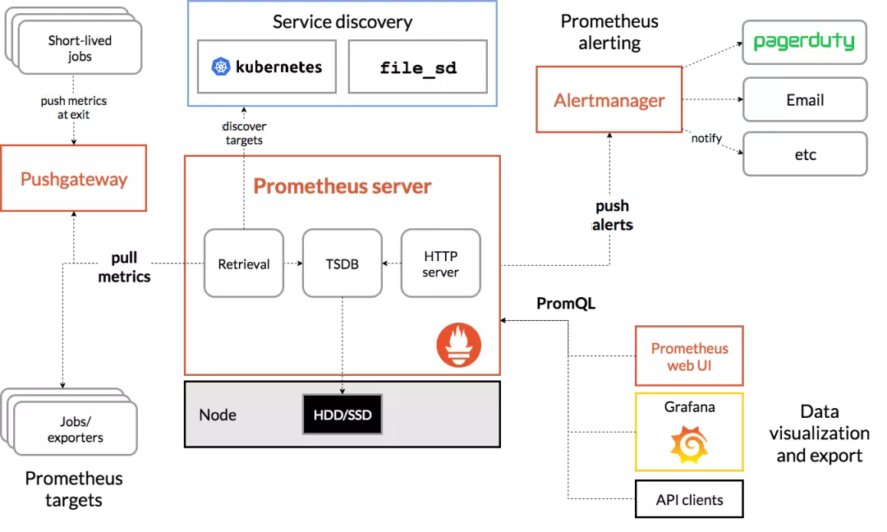
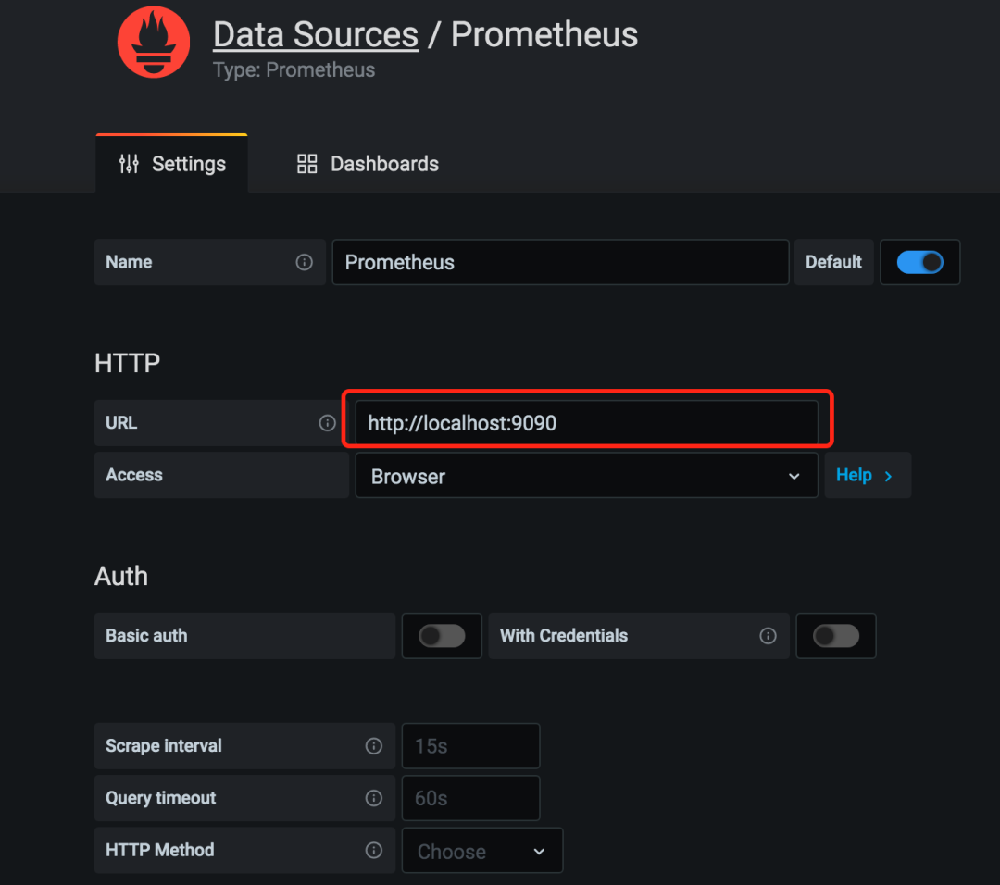
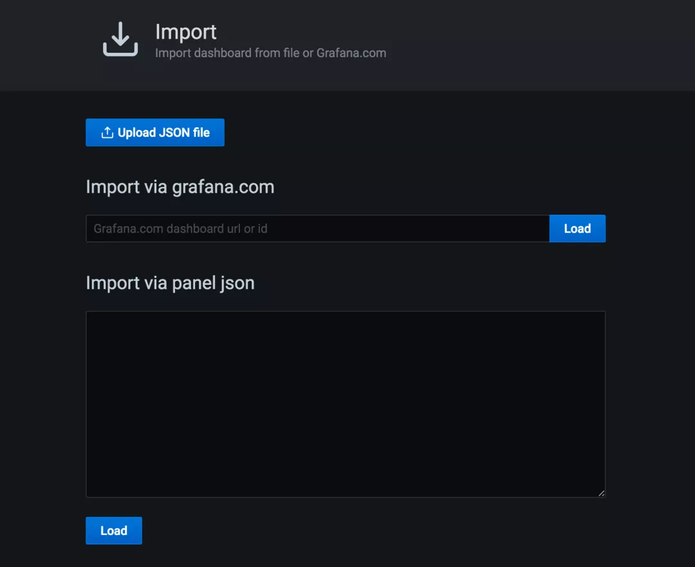
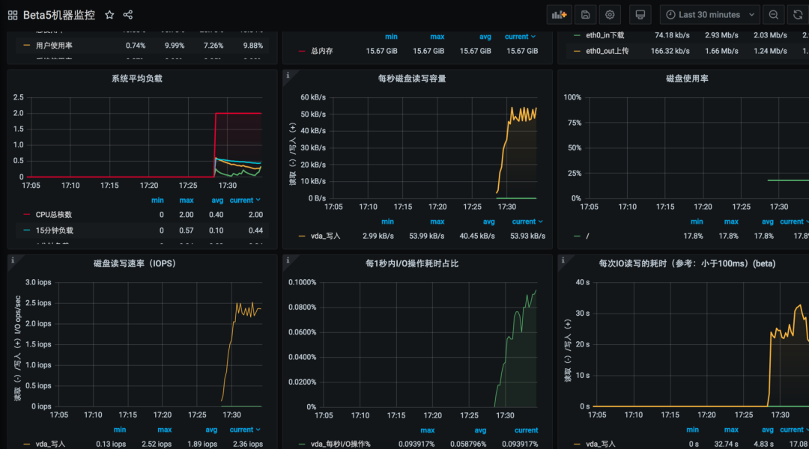

Prometheus：普罗米修斯，这名就有一种高大上的感觉。那么普罗米修斯到底是干嘛的呢？一句话总结：**Prometheus 是一个开源的服务监控系统和时间序列数据库。**

抓住三个词，即 开源，监控，时间序列数据库。

**开源：** 意味着我们可以免费使用，有问题可以给社区提 Issues 寻求帮助，也可以自己提一些新功能或者 Bug 修复的 PR，共建强大的生态圈。

**监控：** 意味着普罗米修斯可以用于监控场景，监控我们的服务器，监控我们的数据库，监控我们的应用程序，它都用的上。

**时间序列数据库：** 维基百科上对于时间序列的定义是‘一系列数据点按照时间顺序排列’，其实就是根据时间点存储的信息，这些信息是不可变的。目前在监控场景用的比较多。

对比一些老牌的监控，比如 zabbix，Prometheus 近几年在容器监控方面表现的非常突出，人家就是干这个事情的。对于新的监控选型，我觉得大家可以尝试下 Prometheus。

虽然监控这个工作属于运维这块的，理应要有专业的运维工程师来做。我认为作为一个后端开发，也必须要懂得一些监控相关的知识和技能储备。万一你去了创业公司，很可能什么工作都是你来做。

## Prometheus 中的一些概念

### Prometheus Server

Prometheus Server 是 Prometheus 组件中的核心部分，负责实现对监控数据的获取，存储以及查询。

### Exporter

Exporter 将监控的数据采集起来，通过 HTTP 服务的形式暴露出去，Prometheus Server

会定时去拉取这些暴露的数据进行监控。

官方已经提供了很多的 Exporter，比如 Mysql 等。下载地址：https://prometheus.io/download/

如果是监控我们的应用程序，可以在程序中集成官方的 SDK，自己埋点暴露出需要监控的指标即可。

### PushGateway

PushGateway 作为一个独立的服务，大部分场景下我们用的是 pull 模式，也就是 Prometheus Server 去拉取 Exporter 提供的数据，如果想使用 push 模式的话，可以将数据 push 给 PushGateway，由 PushGateway 统一提供数据给 Server。

### Service Discovery

服务发现是一个特别重要的功能，特别是在微服务场景下监控显得尤为重要。如果没有服务发现的功能，那么每启动一个服务就需要去修改 Prometheus 的配置文件增加对应的配置。

有了服务发现的功能，可以动态的去发现服务信息，无需手动修改配置。官方推荐用 Consul 作为服务发现，像我们用 Nacos 的话，目前是不支持的，还需要想办法进行处理，比如定时拉取信息同步到文件中。

### 三剑客

Prometheus 目前的标配都是和 Grafana，AlertManage 一起使用的，三剑客。跟 ELK 是一样的，正所谓三个臭皮匠赛过诸葛亮。

- Prometheus

负责拉取监控数据，存储。

- Grafana

负责展示各种监控指标，通过图形化的方式。

**Prometheus 负责赚钱养家，Grafana 负责美貌如花。**

- AlertManage

负责异常告警，可以对接钉钉等多种消息通知。

### 生态系统组成



## 体验下 Prometheus 的魅力

最近闲来无事，我也打算学习下 Prometheus。一是为了扩充自己的知识面，二也是看看能不能将其在工作中使用起来。

对于主机，数据库相关的监控，很多公司都在云上面，云平台本身就提供了很好的监控告警体系，也没必要再用 Prometheus 去搞一套了。

其他场景也是可以使用的，比如指标监控，监控应用的一些指标。也可以用于业务指标监控，总之玩法很多，就看你怎么玩。

自己学习体验的话直接用 Docker 拉镜像创建吧，简单，快速，方便。

### 部署 Prometheus

```
docker run -d -p 9090:9090 -v /Users/yinjihuan/Downloads/prometheus/prometheus.yml:/etc/Prometheus/Prometheus.yml prom/prometheus
```

Prometheus.yml

```
global:
  scrape_interval:     15s
  external_labels:
    monitor: 'codelab-monitor'
scrape_configs:
  - job_name: 'prometheus'
    scrape_interval: 5s
    static_configs:
      - targets: ['localhost:9090']
  - job_name: beta_node
    static_configs:
      - targets: ['10.111.83.8:9100']
```

定义了两个任务，一个是 Prometheus 自己的监控，它本身也是一个服务，也会暴露出一些指标信息。

一个是机器的监控任务，目标需要配置 IP+PORT，对应的机器上要装 node_export 才行，通过 node_export 将机器的指标数据暴露，Prometheus 才能拉取到进行监控。

### 部署 Grafana

```
docker run -d -p 3000:3000 --name=grafana -v /Users/yinjihuan/Downloads/Grafana-storage:/var/lib/grafana  grafana/grafana
```

### 部署 node_export

从官网下载对应的 node_export:https://prometheus.io/download/#node_exporter

解压后直接启动即可，nohup ./node_exporter & 启动，默认端口 9100。此机器 IP 就是上面 beta_node 中的 IP10.111.83.8。

### 配置 Grafana 图表

访问 localhost:3000 就是 Grafana 的主页，然后在设置里面创建一个数据源，指向 Prometheus 的地址。



然后导入一个你喜欢的图表进行关联即可，图表可以去https://grafana.com/grafana/dashboards?search=node进行搜索，比如搜 node 就会展示所有 node_export 相关的图表，每个图表有一个编号，直接根据编号 load 即可，需要联网。



机器监控效果



后续其他的一些操作，等我体验后再给大家分享踩坑记录。