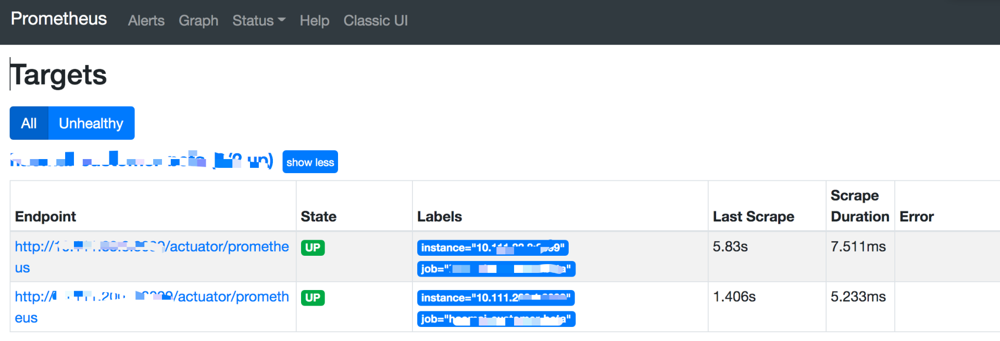
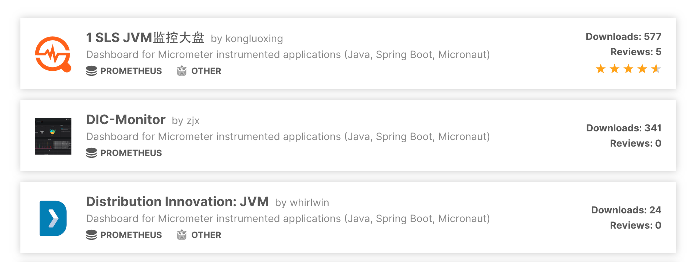
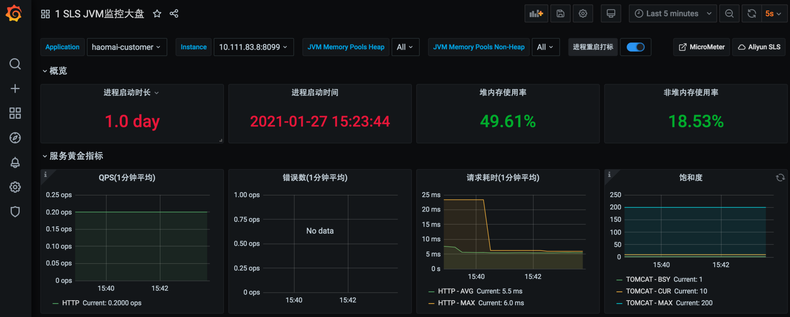

# Prometheus为你的SpringBoot应用保驾护航

前面我们介绍了Prometheus的作用和整体的架构，相信大家对Prometheus有了一定的了解。

具体可以查看这篇文章：[mp.weixin.qq.com/s/QoAs0-AYy…](https://mp.weixin.qq.com/s/QoAs0-AYy8krWTa3HbmJZA)

今天着重介绍下如何在项目中将Prometheus用起来，结合漂亮的图表做数据展示，真的非常帅气。

使用之前先介绍一个Micrometer，Micrometer 是一款监控指标的度量类库，提供了对各种指标的监控。比如JVM, 线程池，数据库连接池等。

官方网站：[micrometer.io/](https://micrometer.io/)

## 项目集成

首先在项目中添加下面的Maven依赖，如下：

```plain
<dependency>
    <groupId>org.springframework.boot</groupId>
    <artifactId>spring-boot-starter-actuator</artifactId>
</dependency>
<dependency>
    <groupId>io.micrometer</groupId>
    <artifactId>micrometer-registry-prometheus</artifactId>
    <version>1.5.9</version>
</dependency>
```

增加对应的配置，如下：

```plain
management:
  endpoints:
    web:
      exposure:
        include: "*"
  metrics:
    tags:
      application: ${spring.application.name}
```

exposure.include配置你要暴露的端点信息，全部就配置成 * 号。

tags.application配置成跟服务名一样即可。

访问/actuator/prometheus就可以看到很多指标数据了，至于这些数据是怎么出来的就不做过多讲解，对应的代码都在micrometer-registry-prometheus包中，大家可以自己去研究下。

```plain
# HELP hikaricp_connections_max Max connections
# TYPE hikaricp_connections_max gauge
hikaricp_connections_max{application="haomai-customer",pool="HikariPool-1",} 10.0
# HELP process_start_time_seconds Start time of the process since unix epoch.
# TYPE process_start_time_seconds gauge
process_start_time_seconds{application="haomai-customer",} 1.611642684781E9
# HELP jvm_gc_max_data_size_bytes Max size of old generation memory pool
# TYPE jvm_gc_max_data_size_bytes gauge
jvm_gc_max_data_size_bytes{application="haomai-customer",} 2.68435456E8
# HELP tomcat_sessions_created_sessions_total  
# TYPE tomcat_sessions_created_sessions_total counter
tomcat_sessions_created_sessions_total{application="haomai-customer",} 0.0
```

## 数据采集

如果没有做服务动态发现，那就手动修改Prometheus配置文件，新增一个任务进行抓取。

```plain
 - job_name: 'haomai-customer-beta'
    scrape_interval: 5s
    metrics_path: '/actuator/prometheus'
    static_configs:
      - targets: ['192.168.1.49:8099']
```

在Targets中查看是否成功。



## 数据展示

先去grafana搜一个帅气的图表，地址如下：

[grafana.com/grafana/das…](https://grafana.com/grafana/dashboards?search=springboot)

选第一个就行了，星星数量多点。



点进去复制图表的编号12856，去grafana中导入即可，选择数据源就可以展示了。



当然像数据库连接之类的也可以去搜专门的图表来展示，或者自定义图表，这个后面再给大家介绍。

同样还有告警也是需要单独做的，可以用grafana自带的告警来做，也可以单独部署Alertmanager来做告警。后续再单独再介绍哈。