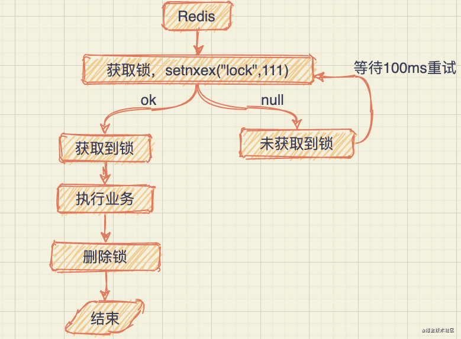
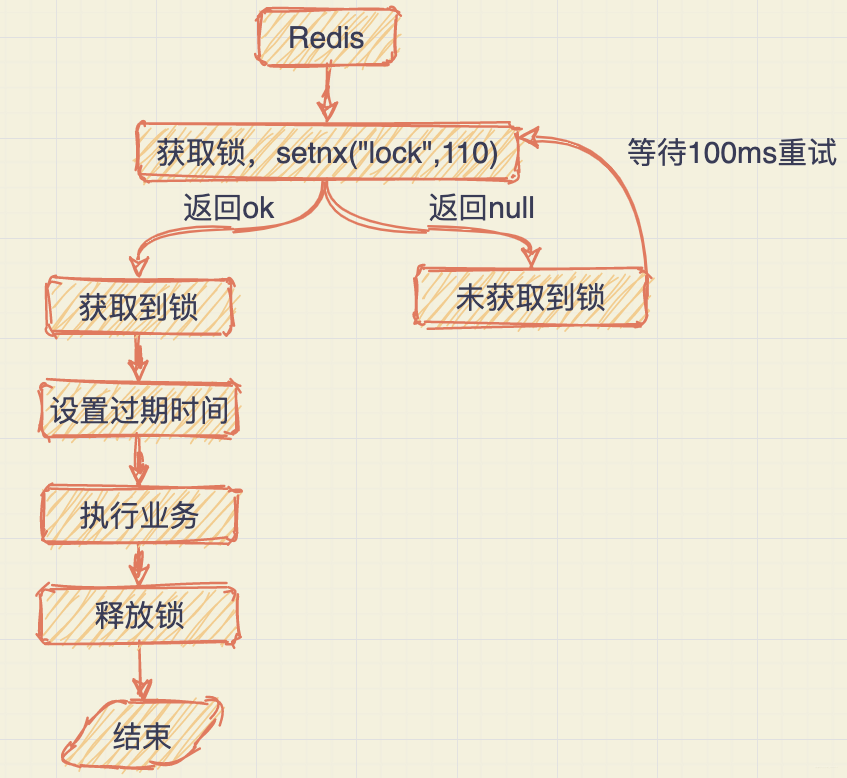
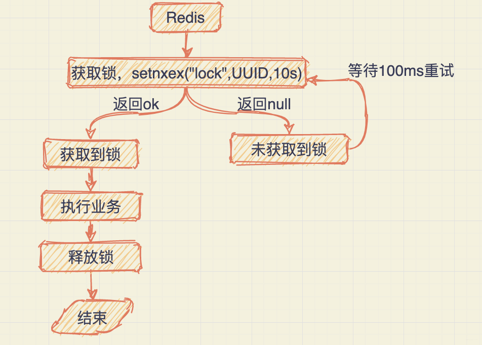
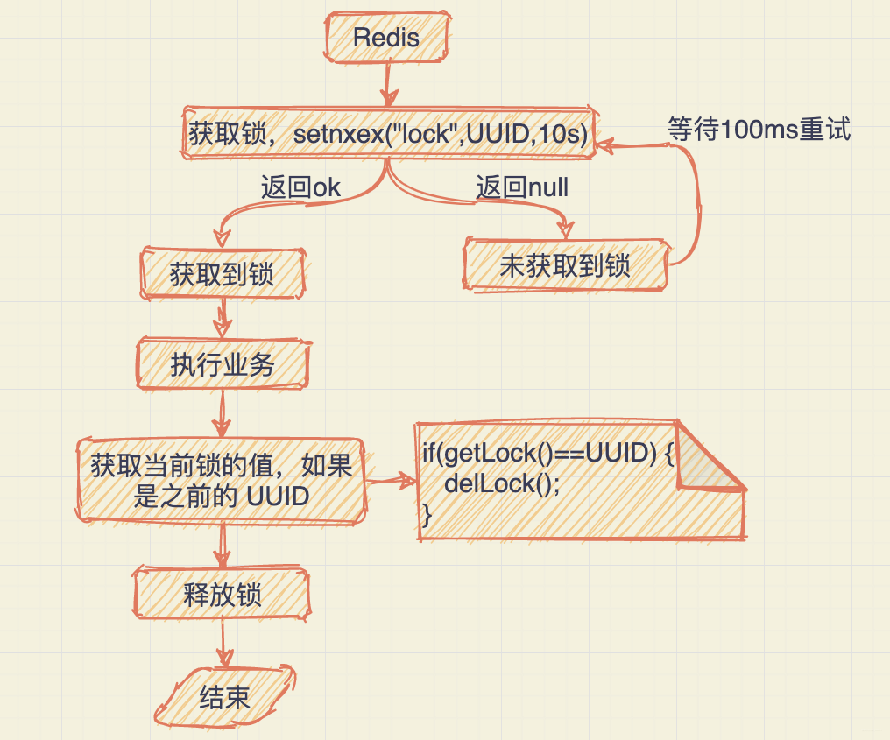
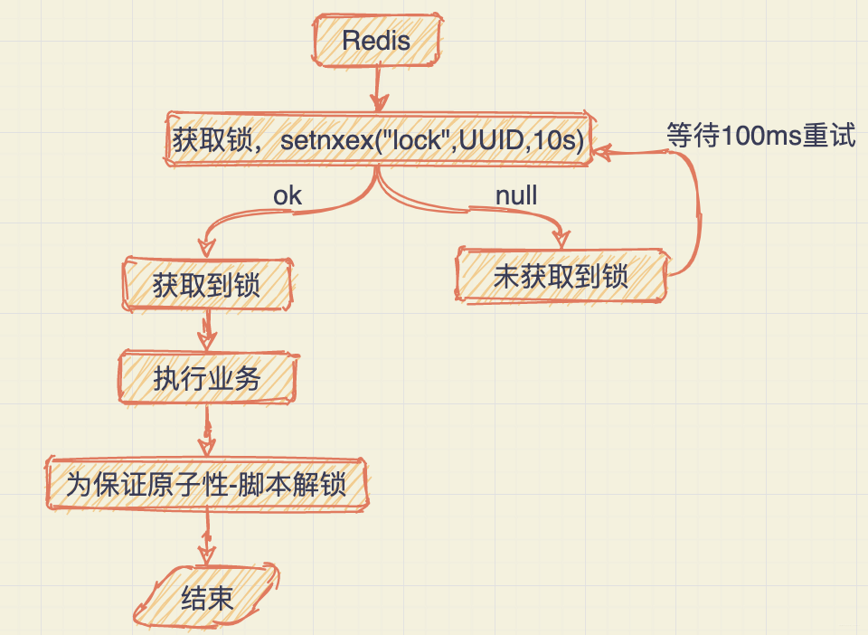

# 1 本地锁

常用的即 synchronize 或 Lock 等 JDK 自带的锁，只能锁住当前进程，仅适用于单体架构服务。 而在分布式多服务实例场景下必须使用分布式锁

# 2 分布式锁

## 2.1 分布式锁的原理

### 厕所占坑理论

可同时去一个地方“占坑”：

- 占到，就执行逻辑
- 否则等待，直到释放锁

可通过自旋方式自旋

“占坑”可以去Redis、DB、任何所有服务都能访问的地方。

## 2.2 分布式锁演进

### 一阶段

```java
// 占分布式锁，去redis占坑
Boolean lock = redisTemplate.opsForValue().setIfAbsent("lock", "111");
if(lock) {
	//加锁成功... 执行业务
	Map<String, List<Catelog2Vo>> dataFromDb = getDataFromDb();
	redisTemplate . delete( key: "lock");//fHßti
	return dataF romDb ;
} else {
	// 加锁失败，重试。synchronized()
	// 休眠100ms重试
	// 自旋
	return getCatalogJsonFromDbwithRedisLock();
}
```



#### 问题场景

- setnx占好了坑，但是业务代码异常或程序在执行过程中宕机，即没有执行成功删除锁逻辑，导致死锁

解决方案：设置锁的自动过期，即使没有删除，会自动删除。

### 阶段二



```java
// 1. 占分布式锁，去redis占坑
Boolean lock = redisTemplate.opsForValue().setIfAbsent( "lock", "110")
if(lock) {
	// 加锁成功...执行业务
	
	// 突然断电
	
	// 2. 设置过期时间
	redisTemplate.expire("lock", timeout: 30, TimeUnit.SECONDS) ;
	Map<String, List<Catelog2Vo>> dataFromDb = getDataFromDb();
	//删除锁
	redisTemplate. delete( key; "lock");
	return dataFromDb;
} else {
	// 加锁失败...重试。 synchronized ()
	// 休眠100ms重试
	// 自旋的方式
	return getCatalogJsonF romDbWithRedisLock();
}
```

#### 问题场景

- setnx设置好，正要去设置过期时间，宕机，又死锁

解决方案：设置过期时间和占位必须是原子操作。redis支持使用setNxEx命令

### 阶段三



```java
// 1. 分布式锁占坑
Boolean lock = redisTemplate.opsForValue().setIfAbsent("lock", "110", 300, TimeUnit.SECONDS);
if(lock)(
	// 加锁成功，执行业务
	
	// 2. 设置过期时间，必须和加锁一起作为原子性操作
	// redisTemplate. expire( "lock", з0, TimeUnit.SECONDS);
	Map<String, List<Catelog2Vo>> dataFromDb = getDataFromDb();
	// 删除锁
	redisTemplate.delete( key: "lock")
	return dataFromDb;
else {
	// 加锁失败，重试
	// 休眠100ms重试
	// 自旋
	return getCatalogJsonFromDbithRedislock()
}
```

### 阶段四



已经拿到了 lockvalue ，有了 UUID，但是过期了现在！其他人拿到所锁设置了新值，于是 if 后将别人的锁删了！！也就是删除锁不是原子操作。

```java
Map<String, List<Catelog2Vo>> dataFromDb = getDataFromDb();
String lockValue = redisTemplate.opsForValue().get("lock");
if(uuid.equals(lockValue)) {
	// 删除我自己的锁
	redisTemplate.delete("lock");
}
```

#### 问题场景

- 如果正好判断是当前值，正要删除锁时，锁已过期，别人已设置成功新值。那删除的就是别人的锁.
- 解决方案

删除锁必须保证原子性。使用redis+Lua脚本。

### 阶段五

- 确保加锁/解锁都是原子操作

```lua
String script = 
	"if redis.call('get', KEYS[1]) == ARGV[1] 
		then return redis.call('del', KEYS[1]) 
	else 
		return 0 
	end";
```

保证加锁【占位+过期时间】和删除锁【判断+删除】的原子性。

# 总结

其实更麻烦的事情，还有锁的自动续期。所以不管是大厂还是中小型公司，我们都是直接选择解决了这些问题的 Redisson！不重复造轮子，但也要知道该框架到底解决了哪些问题，方便我们遇到问题时也能快速排查定位。 下一篇我们就开始 redisson 讲解他是如何做到锁续期的~