菜刀是料理新手最重要的工具之一，怎么用?让料理达人蔡季芳一次说清楚，以家中常用的片刀，示范蔬菜与肉类料理时常见的刀工处理，厨房菜鸟一看就懂!

# 蔬菜的6种切法

蔬菜的基本切法：切丝、切片、切段、滚刀块、切花、切末。

## 1.切片要诀：

千万不要用剁刀切片，成品会厚且丑、不够薄，用片刀来切才正确，尤其是切薄片时更好用。切片时，右手握刀，目测好切片的厚度，刀微斜后下刀。

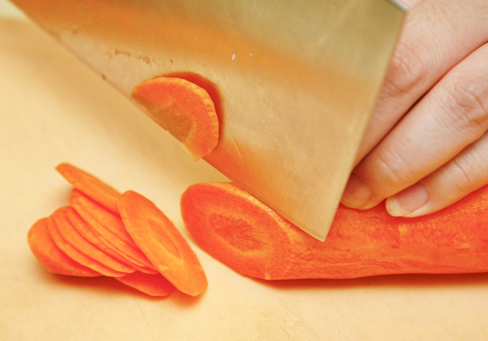

## 2.切丝要诀：

一定要先切薄片后，才能再切丝。

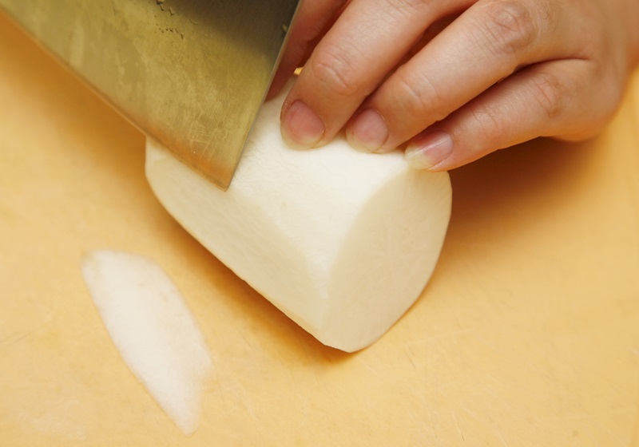

同样再用左手手指微弯顶住刀背，右手微斜下刀将白萝卜先切一长片，必须将长片边做底这样白萝卜站得稳。

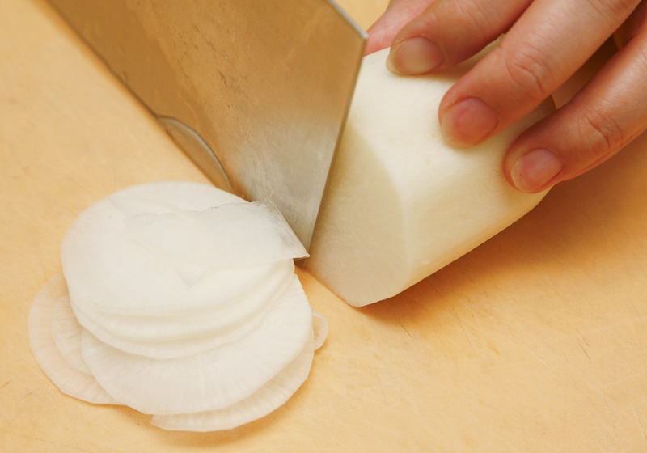

将萝卜块转向后，以刚刚切长片处摆在砧板上，用手固定不滑动后。同样再用左手手指微弯顶住刀背，右手握刀以微斜下刀的方式切圆剖面切片。

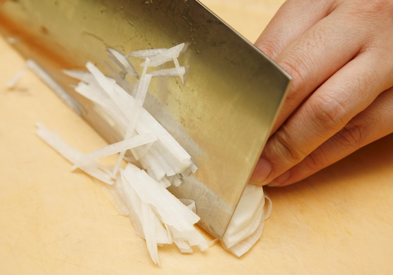

再将切下的原形薄片整理好成一叠，再下刀切丝，完成。

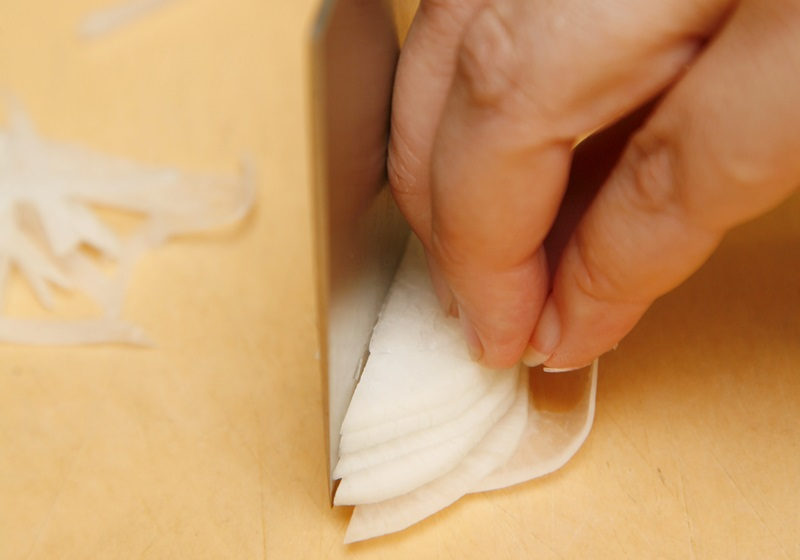

手指头弯曲、顶住刀背，这样才不会切到手指。

## 3.滚刀块：

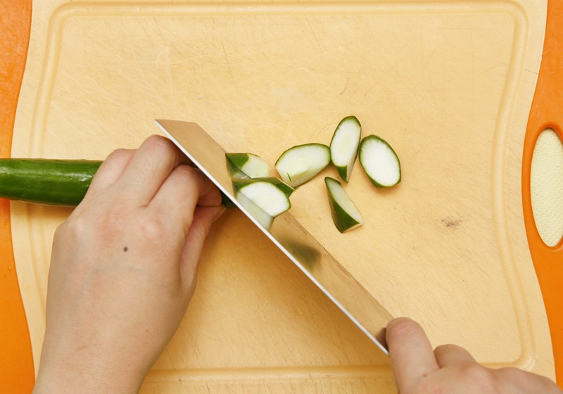

要诀：身体是6点钟、刀是5点钟、刀尖是11点钟方向，切的时候刀不动，只转动食材，切出来的块状就是滚刀块。需注意的是，切滚刀块时，左手一定要拿稳食材，随着持菜刀右手切块后再慢慢滚动。

## 4.切段：

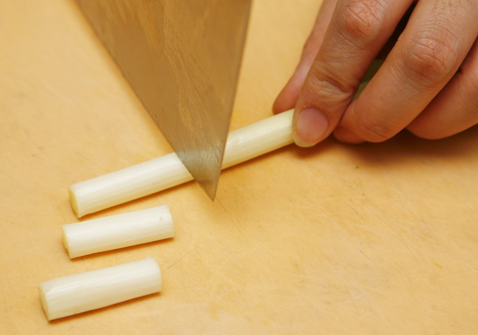

要诀：每一段不超过一吋为佳，切葱段时建议将2～3支葱去除尾端后再洗净，在砧板上摆好后，从葱白部分开始切，手指压住葱支再顺势慢慢往前，最后切至葱绿部分即可。

## 5.切花：

要诀：先切成每段约2吋的长段，这样切花时，手才有地方放。

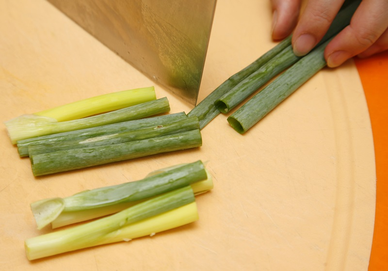

将葱白与葱绿长段排好。

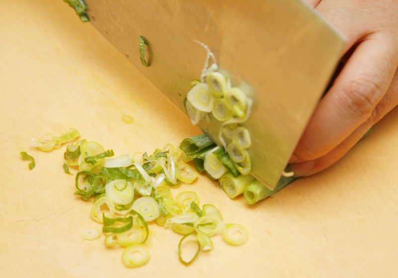

开始切葱花时，因其为细碎状，故建议新手放慢速度，不要求快。左手手指微弯顶住刀背后，右手握刀再微斜状下刀切细碎状即可。

## 6.切末：

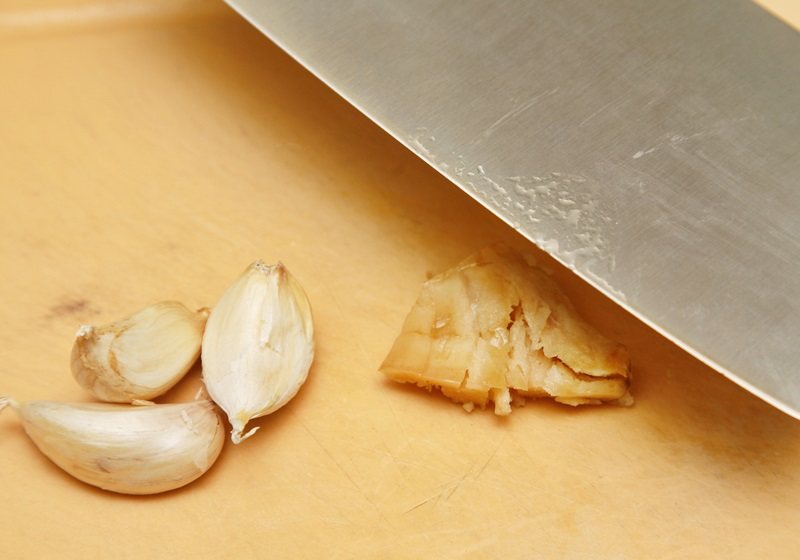

先用刀背将食材拍扁，建议一手持刀，另一手可以就近围住食材以避免其突然滑落。注意食材先不要去皮，以免汁液与碎末四散。

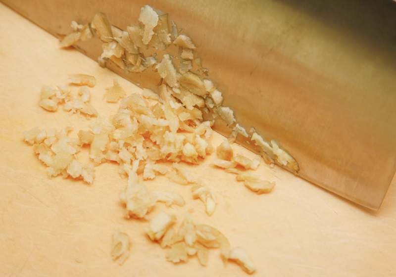

去皮后再切细碎。切碎时，可将食材集合再一起，左手按住、右手下刀慢切。新手较没把握时，可先切成粗粒状，再一起剁成细碎。

# 肉类有这三种切法

鲜肉的基本切法：切片、切块、切丝。

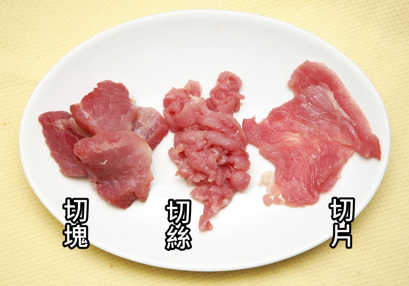

## 切肉块要诀：

左手一面按住肉块，且手指微弯顶住刀背，微斜式下刀切块，确认肉已切断后，再切下一块。记得要逆纹下刀，这样料理后的肉块才会Q。

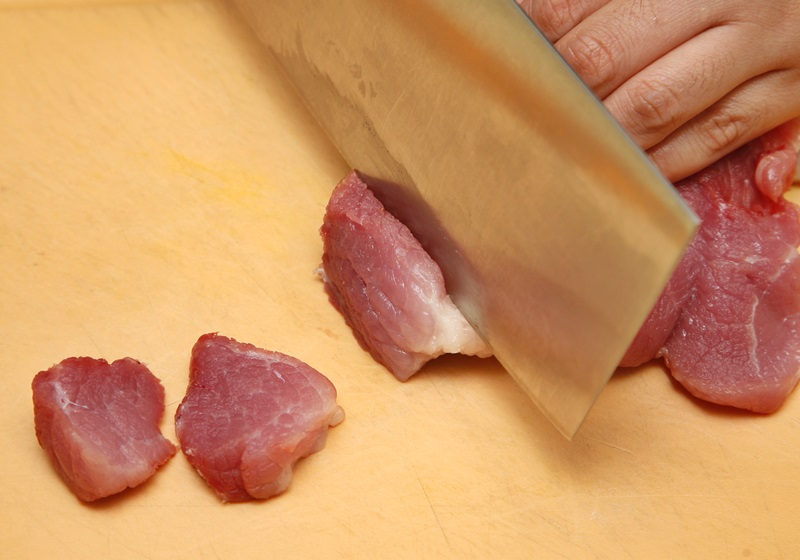

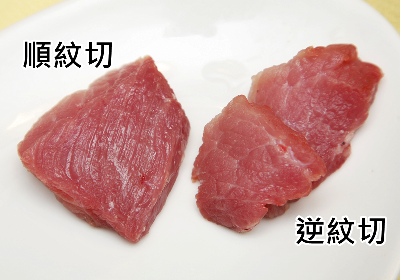

顺纹下刀切的肉块吃起来会比较老，且容易塞牙缝;尤其是肉质较硬的牛肉，建议逆纹切。

## 切肉片要诀：

右手持刀，刀背倾向肉块那侧那后下刀，并将片刀以前后拉锯法切出肉片。一定要用片刀之类的薄刀来切，肉片才会薄;用剁刀切片，成品会较厚且不美观。

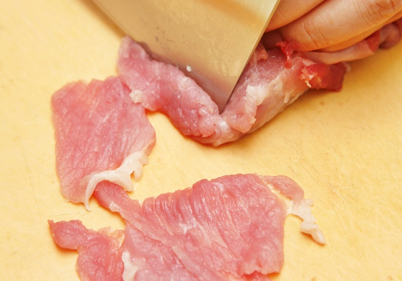

## 切肉丝要诀：

先用片刀将食材切成较厚的肉片，再切成肉丝，重点是刀子要利且薄才切得断。此外，肉块建议先放到冰箱微微冷冻后，再切片或切丝较容易切。

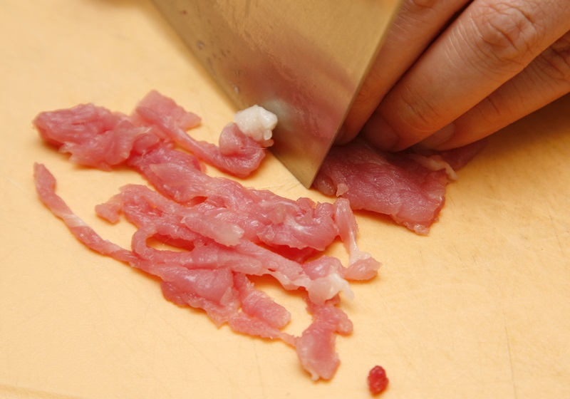

# 料理新手刀工小提醒

防黏刀法：刚开始刀工练习时，肯定不顺手。如切肉片时不是黏刀就是黏手，建议将刀身蘸点水，即可产生润滑刀口的作用，这样在下刀切肉片就不会黏在一起了。

切丝不切碎：切肉丝与蔬果切丝时，并非切得越细越好，以免肉丝料理时容易碎而散，影响卖相，蔬果切丝过细则容易流失营养素，成品也不够大方。

熟能生巧：刀工是门熟能生巧的学问，新手们从食材处理开始多练习，有空多下厨，时日一久，自然突飞猛进。

5号网版权所有